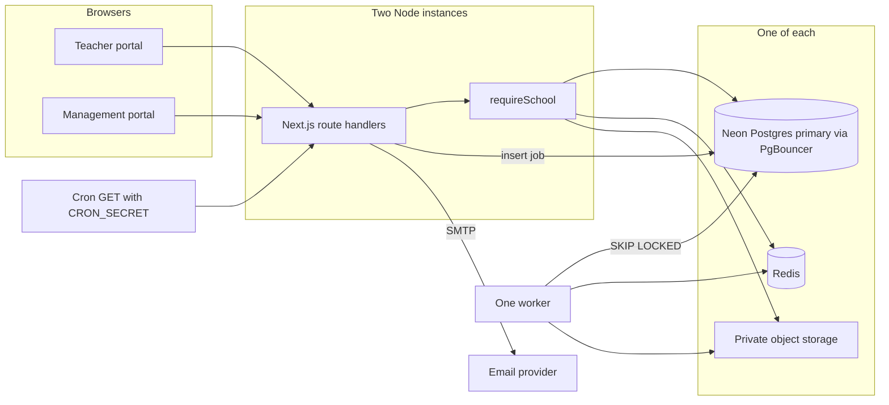
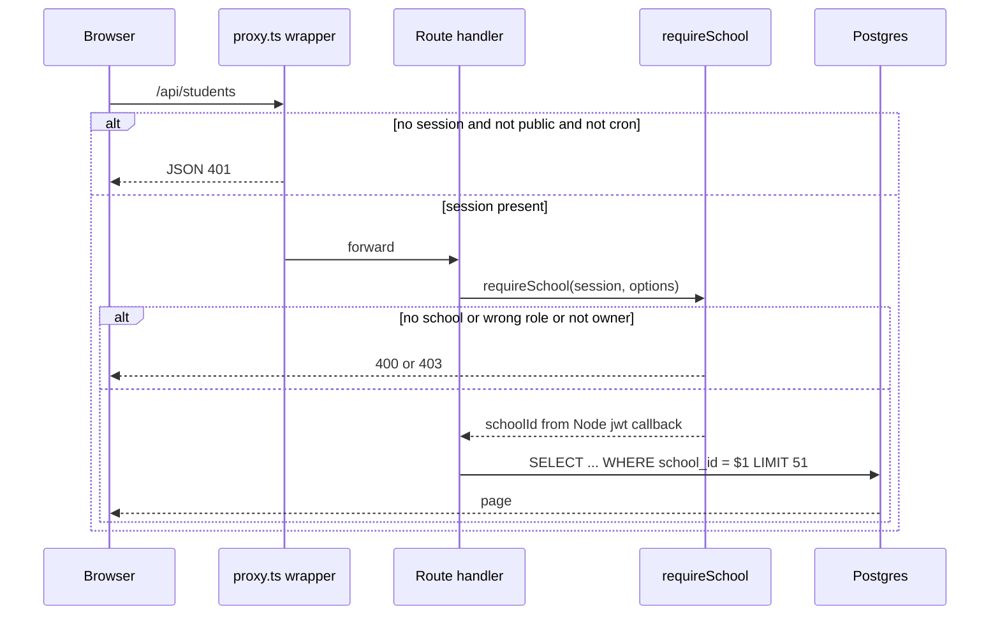
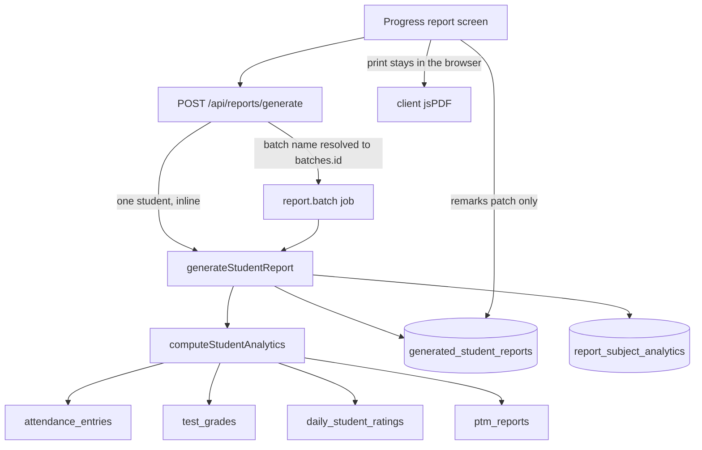

# Academic Planning System — Reconnect the monolith for 50,000 concurrent sessions

**Author:** _[name]_
**Date:** 2026-09-23
**Status:** Draft
**Product:** Academic Planning System (UI brand today: EduAdmin Pro)
**Repo:** `C:\Users\kunal\OneDrive\Desktop\projects\ACADEMIC-PLANNING-SYSTEM`
**Audience:** senior engineers who already know this codebase

This document describes the target shape of the product that already exists. It does not add a parent app, a student app, or a payment gateway. It reconnects the features that are already integrated, closes the tenant and auth holes that were verified in code, and sizes that one app for 50,000 concurrent authenticated sessions.

Claims below were checked against source on 2026-09-23. Where the internal audit (`docs/INTERNAL-PRODUCT-AUDIT.md`) is slightly wrong, the correction is in the text. The audit was not treated as a spec.

---

## Overview

The product is a multi-school staff system: a management portal and a teacher portal. Roles in the database are only `teacher` and `management` (`user_role` in `lib/db/schema.ts`). Schools are the tenant. Management users belong to many schools through `admin_schools` and switch the active one. Teachers belong to one school. Academic data is supposed to be scoped by `schools.id`.

The core workflow is already on Postgres through Drizzle: roster, faculty, timetable, attendance, syllabus, tests, a manual fee ledger, counseling, meetings, calendar, daily reports, PTM notes, and class promotion that a human confirms. Several of those features are not one data path. `proxy.ts` skips every `/api` route. Recruitment handlers never call `auth()`. A null `schoolId` drops the tenant predicate. Live Mongo routes are public and insert demo rows. Reports, feedback, schedules, and curriculum each have a second writer. The database client is Neon’s HTTP driver (`drizzle-orm/neon-http` in `lib/db/index.ts`), which is one HTTPS round trip per statement and cannot run `db.transaction`. A search of the TypeScript source finds no `db.transaction`.

The target is the same Next.js 16 / React 19 app, the same two portals, one Postgres database, one Redis, one worker process in this repo, and private object storage. Route handlers stay. Every handler that touches tenant data goes through one `requireSchool(session)` guard. Handlers that must run before a school exists (`create`, `join`, `active-school`) use `requireSession` instead. Lists are cursor-paginated and indexed. Writes that must be atomic run as chunked transactions on a pooled Postgres connection. The worker runs batch report-row computation, CSV import, and class-promotion detection and apply. OTP mail stays in the auth route. Browser jsPDF downloads stay in the browser.

50,000 concurrent users means 50,000 live authenticated sessions, not 50,000 requests in flight and not 50,000 accounts in total. The capacity math is in [Capacity](#capacity). The short version: size for about 1,250 read requests per second sustained and 2,000 for a minute, with write spikes of a few dozen transactions per second. That is two Node instances, a Neon primary starting at 4 CU behind the transaction pooler (confirmed by a drill, not by assertion), and a small Redis. Pool size comes from Little’s law, about 80 sessions at a 15 ms checkout. It does not fit on the current HTTP driver plus `select()` of whole tables.

---

## Background & Motivation

### What is running today

| Layer | As it is in the repo |
|---|---|
| App | Next.js 16.2.4 App Router, React 19, Tailwind 4. One `next start` process. |
| Auth | NextAuth v5 credentials, JWT, bcrypt cost 12. Teacher email OTP. Management invite code. `SESSION_REVERIFY_INTERVAL_MS` = 5 minutes in `lib/auth.ts`. |
| DB | Postgres on Neon. `lib/db/index.ts` uses `neon()` from `@neondatabase/serverless` and `drizzle-orm/neon-http`. |
| Second DB | `mongoose` and `lib/mongodb.ts`. Five route files still connect. |
| Files | Vercel Blob private `put` / `get` (`app/api/blob/upload/route.ts`, `app/api/blob/serve/route.ts`) plus unauthenticated `app/uploads/[filename]/route.ts`. |
| Cron | `vercel.json`: `GET /api/cron/class-promotion` at 03:00. Guarded by `CRON_SECRET`. The handler loops every active school inside the HTTP request. |
| Tests | Jest uses the same `DATABASE_URL` the app uses. `lib/db/dbGuard.ts` turns some unscoped `DELETE`s into an empty success. |

Page routes under `/management` and `/teacher` go through the NextAuth `authorized` callback. API routes do not. `proxy.ts`:

```ts
matcher: ['/((?!api|_next/static|_next/image|favicon.ico).*)']
```

A missed `auth()` call is a public endpoint. Recruitment is the proof: `app/api/recruitment/**` has no `auth()` call, and the handlers do `db.select().from(table)` with no school predicate (`requirements`, `candidates`, `appraisals`, `dashboard`, `audit-logs`). `POST /api/recruitment/interviews` calls `notifyRoleInSchool(['teacher', 'management'], null, ...)`. In `lib/notify.ts`, a null school skips the school filter and inserts one notification per teacher and management user in the database.

### Pain points that are already in the code

1. **Tenant filter is optional.** `listStudents` in `lib/db/queries/students.ts` adds `eq(students.schoolId, filters.schoolId)` only inside `if (filters.schoolId)`. The same pattern is in `lib/db/queries/fees.ts` (`listFeePayments`, `listFeeStructures`, `computeFeeStats`), meetings, tests, assignments, curriculum, and others. `GET /api/students` passes `session.user.schoolId`. When that is null the query returns every active student, including `aadharNumber`. `GET /api/fees/payments`, `GET /api/fees/structures`, and `GET /api/fees/stats` take `schoolId` from the query string before the session. `GET /api/schedule` and `GET /api/special-classes`: for `role === 'management'`, `schoolId=ALL` adds no school condition, so the query is every school’s rows. `loadAuthorizedTest` (`lib/db/queries/tests-auth.ts`) rejects a mismatch only when both the session and the test row have a `schoolId`.
2. **A teacher can wipe a roster.** `DELETE /api/students/bulk` allows `teacher` and `management`. The comment says management only. `deleteAllStudents(null)` runs `db.delete(students)` with no `WHERE`. The db guard blocks that unscoped delete and the route still returns `{ success: true }`. With a real `schoolId` the guard does not apply.
3. **Demo writers.** `POST /api/fees/seed` inserts JEE fee structures and fake receipts for the first real students (`academicYear: '2024-25'`). `GET /api/protocols` inserts three 2023 policies when the school has zero rows. `ProgressReportView.tsx` opens a form at `2025-2026` with Mathematics 85, Physics 78, Chemistry 82, and posts it to `/api/reports/generated`. The button does not call `POST /api/reports/generate`.
4. **Two databases.** Public Mongo routes seed a global board: `app/api/academic-planning/route.ts`, `app/api/teacher-portal/route.ts`, `app/api/teacher-portal/schedule/route.ts`, `app/api/recruitment/orientations/route.ts`. `app/api/teacher/feedback/route.ts` is authenticated but unscoped and returns average `4.8` on an empty collection. `TeacherFeedbackView.tsx` fetches both `/api/feedback` (Postgres) and `/api/teacher/feedback` (Mongo).
5. **No transactions, no pagination, thin indexes.** Promotion confirm (`app/api/academic-planning/promotions/[runId]/confirm/route.ts`) updates students one statement at a time, then bumps batches by name, then the run row. In `schema.ts`, the non-unique `index()` calls that mention `school_id` are only on `master_curriculum`, `student_reports`, and `generated_student_reports`. That is not “no access path”: `uniqueIndex` already includes `school_id` on `batches (school_id, name)`, on promotion runs, and on the partial student roll uniques. `0017_tests_questions.sql` is in the journal and creates `idx_tests_school_date`. `idx_students_school_id` exists only in unjournaled `0010_multitenancy.sql`, so a database built from the journal does not have it. Do not treat “not in `schema.ts` `index()`” as “not in this database”.
6. **Migrations do not rebuild the schema.** `lib/db/migrations` has 57 SQL files. `meta/_journal.json` has 36 entries (idx 0–35), out of numeric order, with duplicated numbers. `npm run db:migrate` is `tsx migrate-http.ts`, which follows the journal. A fresh database will not match `schema.ts`.
7. **Identity is copied as strings**, and three report tables can disagree. Counseling has `studentName` and no `studentId`. `fee_payments.receipt_number` is globally `.unique()`. `daily_student_ratings` is unique on `(studentId, date)` only, and `facultyId` references `users`, not `faculty`.
8. **Files.** Any logged-in user can `GET /api/blob/serve?url=` a private blob, or be redirected to an arbitrary absolute URL. Upload accepts any file into a client-chosen folder.
9. **OTP.** `email_verifications.otp` and `password_resets.otp` are plaintext. `app/api/auth/reset-password/route.ts` reads `attempts` and increments afterwards. Parallel requests can all observe `attempts < 5`.

### Audit corrections (do not “fix” the wrong fact)

- `schools.programs` defaults to `'STEM, Humanities, Arts'` in `schema.ts`. `POST /api/admin/schools` defaults a missing body field to `'JEE, NEET, Foundational'`. Both are template data. They are not the same string. `schools.classes` defaults to `'Nursery – XII'`.
- A `subjects` table already exists (`schema.ts`, `subjects`). The comment on `teacher_subjects` (“no subjects table exists”) is stale. The bug is that `teacher_subjects`, `teacher_batches`, `teacher_programs`, `class_schedules`, and `assignments` still store names.
- `GET /api/schedule` for a **teacher** with a null school returns only rows whose `schoolId` is null, not every school. The cross-tenant read is the management `schoolId=ALL` path, and any caller who passes another school’s uuid. School ids are not secret (`GET /api/schools?joinCode=` returns one).
- `loadAuthorizedTest` returns `{ test: null, forbidden: false }` when both school ids are set and differ. The leak is the null case, not a wrong 403.
- `lib/reports/student-analytics.ts` already reads `test_grades`, `attendance_entries`, `daily_student_ratings`, and PTM rows. The generator is real. The screen does not call it. Ratings and PTM filter by `studentId` only. Attendance uses `if (schoolId)`. Empty ratings use `ratingCount = length || 1` and `ratingToScore[...] || 3`, so a missing label becomes 3. `generate-report.ts` starts a subject grade at `F`. Wiring the button without fixing those filters would publish the wrong card.
- `GET /api/schools?joinCode=` currently returns `{ id, name, board, isActive }`, not three fields. Inactive schools already 403 before that JSON. The success body still includes `isActive`.
- `app/api/attendance/route.ts` keys a session on date, batch, subject, and `classTime`. The comment above `sessionCondition` says `classTime` exists so two sessions of the same subject and batch on the same day do not overwrite each other. Attendance is not one session per section per day.
- `InstitutionalDashboard` loads `/api/school`, `/api/protocols`, `/api/announcements`, `/api/schedule?activeOnly=true`, and `/api/special-classes?date=`. Those are lists the page renders. `countStudentsByClasses` is not on that page. `computeFeeStats` (full-table `select`) is the fee screen.
- Client PDFs (`lib/pdf/reportPdfGenerator.ts`, `meetingPdfGenerator.ts`, `ptmPdfGenerator.ts`, `facultyCvGenerator.ts`) are imported by client components and build a file with jsPDF in the browser. There is no server route whose latency is PDF generation. `POST /api/reports/generate` is the synchronous server loop (`generateBatchReports`).
- `TeacherFeedbackView.tsx` is mounted from the teacher dashboard and calls both `/api/feedback` and `/api/teacher/feedback`. `AcademicPlanning.tsx`, `ScheduleModal.tsx`, and `RecruitmentDashboard.tsx` are not imported. Nothing mounted calls `/api/recruitment/orientations`.
- `PROGRAM_TYPES` is duplicated in `app/api/programs/route.ts` and `components/dashboard/management/AcademicPlanningView.tsx`.

---

## Goals & Non-Goals

### Goals

- One data path per feature, listed in [Feature map](#feature-map).
- One guard for tenant data: missing session is 401, wrong role is 403, missing school is 400, never “no predicate”. A second guard, `requireSession`, covers the few authenticated routes that must work with no school yet (create school, join, list my schools, set the active school, profile photo).
- Postgres only. Mongo models and `lib/mongodb.ts` removed. The orientations Mongo route is deleted. It has no mounted reader, so it does not get a new table.
- Pooled Postgres, chunked transactions, cursor pagination, `school_id NOT NULL` on tenant tables whose nulls can be filled or archived, indexes on `school_id` and the foreign keys used by lists.
- Redis for rate limits, OTP attempt counters, fee and roster aggregates, and short locks. Not a second system of record. Auth fails closed when Redis errors.
- One worker for batch report-row computation, CSV import, and promotion detection and apply. OTP and password-reset SMTP stay in the auth route (`lib/mail.ts` as called from `register/teacher`, `resend-otp`, and `forgot-password`). Browser jsPDF stays in the browser. Cron remains one HTTP call protected by `CRON_SECRET`; it enqueues only when the worker heartbeat is fresh.
- Reports: one table family. The screen and `POST /api/reports/generate` write the same rows, computed from attendance, test grades, and ratings. No sample marks.
- Private objects under `schools/{schoolId}/...`. No public `/uploads/[filename]`.
- Programmes, classes, and the academic-year label are school configuration. No rules engine. No `JEE | NEET | Foundational | Other` allow-list.
- A freelance-operable deploy: two Node instances (or Vercel only under the constraints in [Rollout](#rollout-plan)), Neon with the transaction pooler, Upstash Redis or equivalent, Vercel Blob or S3, one worker.
- p95 targets in [Capacity](#capacity).

### Non-Goals

- Microservices, Kafka, a service mesh, a second framework, a second ORM, or a second auth library.
- Parent login and student login. `students.user_id` and `parents_guardians.user_id` stay unused. Announcement scope “Parents” is a label with no delivery. One sentence, later: a parent/student module would be a new role plus read-only routes on the same tables, not a new stack.
- A payment gateway. Fees stay a manual ledger (cash, UPI, card, cheque, DD typed by staff). No Razorpay, Stripe, or GST invoice engine.
- Quality monitoring. `app/(dashboard)/management/quality/` is empty. The Mongo GPA board is deleted, not ported.
- Branch / campus inside one school. Multi-tenant means many `schools` rows and the existing `admin_schools` switcher.
- Fine-grained roles (accountant, counselor). Owner vs member in `admin_schools` stays the only privilege split, plus the existing teacher vs management split.
- Field-level encryption of Aadhaar. Staff of the same school can still read it on the student detail. It must not leave that school.
- A new frontend. Nav gaps (assignments, teacher feedback) are wiring only.

---

## Capacity

### What “50,000 at a time” means

**50,000 concurrent authenticated users = 50,000 live JWTs**, across many schools, on one deployment. It is not 50,000 requests per second. A school day is read-heavy. Writes come in short spikes: one period’s attendance, a CSV upload, a batch of report rows.

Storage math uses an explicit assumption, not a measurement of any client database:

- 1,000 schools.
- About 50 staff accounts per school, so the morning peak is roughly the whole staff population online (40 teachers + 10 management). 1,000 × 50 = 50,000 sessions.
- About 400 students per school → **400,000 students**.
- Attendance sessions are keyed by date, batch, subject, and `classTime` (`sessionCondition` in `app/api/attendance/route.ts`). Let `S` be sessions per section per day. The code allows several; a coaching day is often 3–6. Default **S = 4** until a client says otherwise.

`attendance_entries` per year ≈ schools × sections × days × S × students per session

= 1,000 × 15 × 180 × S × 30 = **S × 81 million**. At S = 4 that is about **324 million rows per year**, on the order of 100 GB with indexes, not 81 million. S = 1 was wrong. Student rows are not the growth table.

If the real shape is 50 large schools instead of 1,000 small ones, the request math below does not change. The attendance row count does. A read replica is a read offload once list and analytics scans hurt. It is not the response to the insert rate. Revisit storage when the measured `S` and row count are known, not from the S = 1 figure.

### Request math

| Scenario | Assumption | Rate |
|---|---|---|
| Naive poll | Every session hits one endpoint every 60s | 50,000 / 60 ≈ **833 RPS** |
| Target idle behaviour | No 60s poll. Fee and roster aggregates cached 30s. Refresh on navigation. | Idle tabs add ~0 |
| School-day navigation | 15% of sessions active, 30s think time, **4** API calls average. The home view is 5 list calls; other screens are 2–3. | 7,500 / 30 × 4 = **1,000 RPS** |
| Home only | Same active set, every action is the 5-call home fan-out | 7,500 / 30 × 5 = **1,250 RPS** |
| Bell spike, 30s | 20% of sessions open attendance or the roster, 2 calls, on top of the others | about **670 RPS** added |
| JWT re-verify | `SESSION_REVERIFY_INTERVAL_MS` is 5 minutes. 50,000 / 300 ≈ **170** extra primary reads/s, inside the statement budget, not a separate tier. | ~170 reads/s |
| **Design point** | Mixed navigation, with headroom for the home fan-out | **1,250 RPS sustained, 2,000 RPS for 60s** |

`InstitutionalDashboard` fetches `/api/school`, `/api/protocols`, `/api/announcements`, `/api/schedule?activeOnly=true`, and `/api/special-classes?date=`. Those stay as school-scoped list calls. A timetable for one school is a few dozen slots; protocols are a short list; announcements are the first cursor page (50). They are not replaced by a counts blob.

`countStudentsByClasses` does `select()` and returns `rows.length`, and its only callers are `lib/db/queries/students.ts` and its test. It is not the home page. The full-table reduce that staff actually hit is `computeFeeStats` on `FeeManagementView` via `GET /api/fees/stats`. That becomes `count` / `sum` filtered by `school_id`, cached 30s under `dash:{schoolId}:fees`. Roster totals use the same pattern on the students screen. Cache miss is one aggregate, not `select()` of the table.

### Write bursts

| Burst | Shape | Target rate |
|---|---|---|
| Attendance | One request per class session (one `classTime`). One transaction. ≤ 80 `attendance_entries` upserts. One period transition, not every period at once. | 500 class-sessions in a minute ≈ 8 txn/s. Worst aligned bell for one period: 2,000 class-sessions in 60s ≈ **33 txn/s, ~1,300–2,600 rows/s**. If the school submits all `S` periods in that same minute, multiply by `S`. |
| Student or fee CSV | File stored, job queued. Worker commits **200 rows per transaction**. A 5,000-row file is 25 transactions. Natural-key `ON CONFLICT` makes a replay of a committed chunk a no-op. | Ten files at once, one file per school via `lock:import:{schoolId}:{kind}`, up to 4 schools in parallel (worker concurrency below). |
| Batch report rows | `generateBatchReports` is the synchronous loop in `POST /api/reports/generate`. It moves to a job. It writes `generated_student_reports`. It does not render a PDF. | See worker throughput below. Accepting the job is the request. |
| Promotion | Cron enqueues detection only if the worker heartbeat is fresh. Confirm freezes the from/to list, then the worker applies it. | A school of 2,000 students is 10 transactions of 200. Not one transaction of 50,000 rows, and not one statement per row. |

**Worker throughput, derived.** One process runs **4** claimers. Each claim is one job (`LIMIT 1`). Four claimers help only when four jobs exist (four CSV files, or four schools confirming promotion). A second process can claim four more jobs. They do not split one job. There is no priority queue. OTP is not on it.

One `report.batch` job is one claimer. At **200 ms per student** (replace this with a drill) a serial claimer does 1 / 0.2 = **5 students/s**. 8,000 students ≈ **1,600 seconds (about 27 minutes)**, not 400 seconds. That 400-second figure treated four claimers as four students inside one job. They are not.

Inside that one claimer the report job runs **4 students at a time** (`Promise.all` of four `generateStudentReport` calls, then the next four). That is 4 / 0.2 = **20 students/s**, so 8,000 students ≈ **400 seconds**, and it does not require four jobs. Promotion and CSV stay one chunk at a time on their claimer; their chunks are already 200-row transactions, and four of those on one connection would not be four claimers either. This is not “5 PDFs/s”.

If 33 attendance transactions/s of ~80 upserts miss the primary’s budget, the bell gets slower. A read replica does not take those writes. The response is a larger CU or a longer bell, after the upserts are one indexed transaction per class session. The replica is only for list GETs and `computeStudentAnalytics` once those reads contend with the bell.

### p95 targets we will commit to

Measured in the database region, warm instance, indexed query. Email-provider time is not included.

| Operation | p95 |
|---|---|
| Fee or roster aggregate served from Redis | 80 ms |
| Authenticated list, ≤ 100 rows, cursor | 200 ms |
| Single-row write (one fee payment, one rating) | 250 ms |
| Class attendance save (≤ 80 rows, one transaction) | 400 ms |
| Accept a CSV, batch-report, or promotion job | 300 ms |
| One student, inline `generateStudentReport` | 400 ms, otherwise the batch job |
| OTP / reset handler returns | 500 ms, excluding SMTP. `lib/mail.ts` is called in the route with a **5 s** timeout. Forgot-password still returns the generic 200 if SMTP fails. Register and resend return 503 if SMTP fails, so the teacher can retry. Provider time beyond 5 s is not a commit. |

p99 for the list and single-row write is 500 ms. Above that we have a bad query, not a reason to add a platform. These p95 numbers hold only while `pool.waitingCount` is 0. A non-zero waiter means the caller is queued for a connection, and the 200 ms list target is already missed for that request. Do not raise `connectionTimeoutMillis` to hide it. The alert on `waitingCount` is the signal to look at checkout time or CU, not to add a queue product.

### Why Neon HTTP plus whole-table `select()` cannot hit this

`lib/db/index.ts` builds the client with `neon(process.env.DATABASE_URL)` and `drizzle-orm/neon-http`. Each statement is its own HTTPS request. There is no interactive transaction. In-region round trip is typically 15–40 ms; cross-region is 50–150 ms.

At the home fan-out a handler that still does five sequential statements costs 5 × 40 ms = 200 ms of network before any work. 1,250 RPS × 5 statements is **6,250 HTTPS calls per second** to Neon. That is the plan that fails, even before the scans. The 15–40 ms figure is the HTTP driver’s hop. It is not the checkout time of a pooled TCP query. Pool sizing uses its own number below.

The scans:

- `listStudents` returns every active student for the filter. With a null school that is the whole table (400,000 rows in the assumption above), including Aadhaar, into one Node process.
- `listFeePayments` / `computeFeeStats` do `db.select().from(feePayments)` and, for stats, reduce in JavaScript.
- Recruitment dashboard loads all four tables and reduces them in the route.
- `GET /api/programs` with a null school does `db.select().from(programs)` with no `where`.
- Promotion confirm is two round trips per student (update + log insert) with no rollback. A crash leaves some students moved and the run still `pending`.

The HTTP driver also cannot be “fixed” by a larger Neon compute size. Compute does not remove the per-statement HTTP hop or add `db.transaction`.

### Why the replacement fits on a small footprint

Replace the driver, not the ORM:

```ts
import { Pool } from 'pg'
import { drizzle } from 'drizzle-orm/node-postgres'
import * as schema from './schema'

// DATABASE_URL is the Neon *pooled* host (transaction mode, `*-pooler*`).
// Migrations use DATABASE_URL_DIRECT and never the pooler.
const pool = new Pool({
  connectionString: process.env.DATABASE_URL,
  max: Number(process.env.PG_POOL_MAX ?? 35),
  idleTimeoutMillis: 10_000,
  connectionTimeoutMillis: 2_000,
})

export const db = drizzle(pool, { schema })
```

Do not pass a statement `name`. Drizzle’s `node-postgres` session puts `name` on the query config; ordinary calls pass `undefined`, which node-postgres treats as an unnamed statement. Transaction-mode PgBouncer rejects named prepared statements that outlive the transaction. A call that sets `name` is a bug. PR 8 does not merge until one `db.transaction` and one `SELECT … FOR UPDATE SKIP LOCKED` have been run against the pooled host.

PgBouncer transaction mode holds a server connection for the length of one transaction. That is enough for `db.transaction` and for `SKIP LOCKED` inside that transaction. It is not enough for session state (`LISTEN`, named prepared statements, `SET` that must stick). Do not use those.

**Connections, by Little’s law.** Connections held ≈ checkout seconds × statements per request × RPS. The 5 ms figure sizes Node CPU (1,250 RPS × 5 ms ≈ 6.3 cores). It is not how long a connection is checked out. Plan with a **15 ms** checkout for an indexed statement until a 60-second drill measures it. Two statements per request:

| Point | Math | Connections |
|---|---|---|
| 1,250 RPS sustained | 0.015 × 2 × 1,250 | **38** |
| 2,000 RPS for 60s | 0.015 × 2 × 2,000 | **60** |
| Same burst if checkout is 40 ms | 0.040 × 2 × 2,000 | **160** |
| JWT re-verify, 170 reads/s at 15 ms | 0.015 × 170 | **about 3**, already inside the statement rate |

Headroom of 1.5 on the 60-connection burst is **90** server sessions. Two app pools at `max: 35` plus a worker pool of 10 is **80**. That covers the 15 ms assumption for the burst with a little room, and it covers sustained with room to spare. It does **not** cover a 40 ms checkout at 2,000 RPS. Twenty-five sessions (the earlier figure) covers 2,000 statements/s only if checkout is about 12 ms, which was asserted, not measured. `connectionTimeoutMillis` is 2 s so a stuck pool fails the request instead of turning the 200 ms target into a 5 s wait.

**4 CU is a starting size, not a proof.** 1,250 RPS × 2 statements ≈ 2,500 simple indexed QPS, plus the 170 re-verify reads. Run a 60-second drill at the design point before treating 4 CU or `max: 35` as committed. If checkout is over 25 ms or CPU stays above 70%, the first move is a larger CU or fewer statements per request. A replica does not add write connections.

| Piece | Size at the design point |
|---|---|
| App | **2×** machines, 4 vCPU / 8 GB, `next start`. About 6 cores of CPU at 5 ms/request and 1,250 RPS. Two boxes have 8. A third box is allowed only after `PG_POOL_MAX` is lowered so `instances × PG_POOL_MAX + 10 ≤ 90`. At 35 that product is 115 and is over the ceiling. Three boxes use **26** (78 + 10 = 88). |
| DB sessions | **35 + 35 + 10 = 80** with two app boxes. Hard ceiling **90**. Not 50,000. Not 25. |
| Neon primary | Autoscaling **2–8 CU**, start at **4 CU**, change it after the drill. |
| Redis | 256 MB–1 GB (Upstash or one small instance). Fee and roster aggregates are about 1,000 schools × 2 KB. |
| Worker | **1×** 2 vCPU / 4 GB. Four claimers. Same repo. |
| Objects | Existing private bucket. Not on the hot path. |

**Reads that get slow first:** list GETs and `computeStudentAnalytics` on the primary while a bell is inserting `attendance_entries`. **Next step for those reads:** one Neon read replica. Point list GETs and analytics at it. Keep writes, job claims, and auth on the primary.

**Writes that get slow first:** the bell itself, 33 transactions/s of ~80 upserts, earlier if `S` periods land in the same minute, and earlier still at hundreds of millions of `attendance_entries`. A replica does not absorb that. The bell takes longer, or the CU goes up. Do not partition and do not add a second database until both the drill and that choice have been tried.

**What breaks first if the deploy is wrong:** Vercel with an unbounded number of isolates, each holding a `pg` pool of 35. That exhausts the pooler long before CPU does. On Vercel the pool `max` is **1** per isolate, the function region is pinned to the Neon region, and concurrency is capped. The shape this document actually recommends is the two long-running Node processes, because a freelance team can see them and restart them.



---

## Feature map

Status is what the code does today. “Connected” means the live screen reads and writes one Postgres path and is school-scoped when the session has a school. It does not mean the path is safe at 50,000 sessions.

| Feature | What the school gets | Live route / table today | State | Target, one path |
|---|---|---|---|---|
| Auth, teacher OTP | Email + password. Teacher stays `pending_verification` until a 6-digit code. | `app/api/auth/register/teacher`, `verify-email`, `resend-otp`. Tables `users`, `email_verifications`. SMTP is `lib/mail.ts` in the route. | Connected, but OTP is plaintext and the attempt check is read-then-increment. | Same routes. Store `sha256(OTP_PEPPER \|\| otp)`. Compare the hash first. `INCR` and the `attempts` update run only on a mismatch. A correct code at `attempts = 4` succeeds and deletes the row. Redis down is 503 before the compare. Mail stays in the route. Generic errors (no “no account”). |
| Auth, management invite | `MANAGEMENT_INVITE_CODE` creates an `active` user with no school. | `app/api/auth/register/management`. | Connected. One shared root-like code. | Keep the code. Rate-limit it. Do not design SSO. School is still attached afterwards via `admin_schools`. |
| School switch | Management picks an active school. | `PATCH /api/admin/active-school` checks `admin_schools`. JWT re-reads the user at most every 5 minutes. | Connected. | Unchanged. `requireSchool` reads `getSchoolId(session)` only. Never the body, never the query string. |
| Schools, join code, MOU, GST, year start | Name, board, phone, GST, MOU dates, `academic_year_start_month` (default April), join code. | `schools`. Create: `POST /api/admin/schools` (attaches owner). Older `POST /api/schools` does not. Join preview: `GET /api/schools?joinCode=` returns `{ id, name, board, isActive }`. | Connected, two create paths. Join code uses `Math.random`. `PATCH /api/school` spreads the body, including `joinCode` and `isActive`. | One create: `POST /api/admin/schools`. Public preview stays. Success JSON is allow-listed to `{ id, name, board }` (drop `isActive`; inactive is already 403). Join code from `crypto.randomInt`. `PATCH /api/school` allow-lists name, board, phone, GST, address, MOU dates, start month. |
| Programmes | Named programmes inside a school. | `programs`, `program_subjects`. `GET/POST /api/programs`. `PROGRAM_TYPES = ['JEE','NEET','Foundational','Other']`. Null school lists every school. | Connected and over-constrained. | Drop the allow-list. A programme is a row the school creates (`name`, optional `targetExam`). `schools.programs` CSV is not read anymore. |
| Batches and syllabus kanban | Cohorts, chapter/concept progress. | `batches`, `batch_syllabus`, `batch_concept_progress`. Pages under academic planning. | Connected. Batch join is still often by name. | `batches.id` is the foreign key. Name is a snapshot column, not the filter. |
| Class promotion | Detect at the year boundary, human confirms. Classes 9→10→11→12 only. | `lib/classPromotion.ts` `NEXT_CLASS`. Cron `app/api/cron/class-promotion/route.ts`. Confirm route updates one student per statement, then bumps `batches` by name. Tables `class_promotion_runs`, `class_promotion_log`. | Connected for 9–12. Broken for any other class list. Not transactional. A retried chunk would promote twice. | `school_classes.next_class_id`. Cron enqueues detection. Confirm freezes from/to ids. Apply updates `WHERE class = fromClass` in chunks of 200, and commits `jobs.progress` in that same transaction. |
| Curriculum | Chapters, concepts, master curriculum, CSV. | `chapters`, `concepts`, `master_curriculum`. Routes under `app/api/curriculum/**`. | Connected. `lib/db/queries/curriculum.ts` writes sentinel school `00000000-0000-0000-0000-000000000000` when `schoolId` is missing. | `requireSchool`. No sentinel. Null school is 400. Delete sentinel rows in the backfill. |
| Students and guardians | Roster, CSV, dedup, Aadhaar, guardians. | `students`, `parents_guardians`. `app/api/students`, `app/api/students/roster` (management `StudentRosterView.tsx` and teacher `TeacherStudentRosterView.tsx`), `students/bulk`, `students/[id]/guardians`. | Connected when the session has a school. Otherwise all tenants. Bulk delete allows teachers. The roster route reads `program`, `batch`, `parentContact`, `isActive`, and `profileImgUrl` off `listStudents`. Both roster screens pass `profileImgUrl` to `Avatar`. The teacher program/batch filter is in the roster route, not in the view. | `listStudents(schoolId, cursor)` keeps those columns, including `profileImgUrl`. Bulk JSON omits Aadhaar, phone, and address. Detail keeps them. Bulk delete is owner-only. CSV goes to the worker, 200 rows per transaction. |
| Faculty | Directory and CSV. | `faculty`, `teacher_subjects`, `teacher_batches`, `teacher_programs`. `app/api/teacher-portal/faculty`. | Connected. Assignments are name strings. Comment claims there is no `subjects` table; there is. | Keep `faculty`. Point `teacher_subjects.subject_id` at `subjects.id`. CSV through the worker. |
| Timetable | Weekly slots. | `class_schedules`. `app/api/schedule`. Columns `teacherEmail`, `teacherName`, `batch`, `subject` are strings. | Connected for a teacher with a school. Management `?schoolId=ALL` returns every school. | Session school only. Add `faculty_id` (or `teacher_user_id`) and `batch_id`. Email match remains a fallback for old rows until backfill. Delete Mongo `TeacherSchedule`. |
| Special classes | Extra, doubt, revision. | `special_classes`. `app/api/special-classes`. Same `ALL` bypass. | Same hole as the timetable. | Same fix as the timetable. |
| Attendance | Session plus per-student entries. | `attendance_sessions`, `attendance_entries`. `app/api/attendance`. | Connected, school filter optional, no list pagination. | One transaction per class save. Lists by `(school_id, date)` cursor. |
| Daily class report | What was taught, counts. | `daily_reports`. `app/api/daily-report`. Teacher identified by email string. | Connected. | Keep the table. Require school. Store `teacher_user_id`. Snapshot the name. |
| Daily student ratings | Attitude, behaviour, focus, interaction. | `daily_student_ratings`. Unique `(student_id, date)` only. `faculty_id` → `users`. | Connected, and a second teacher rating the same student the same day fails. | Unique `(school_id, student_id, faculty_id, date)`. |
| PTM notes | Parent meeting notes, print. | `ptm_reports`. Teacher PTM page. `ptmPdfGenerator.ts` runs in the browser. | Connected. | Same table, school required. The print button stays a client download. |
| Counseling | Session notes by student **name**. | `counseling_sessions` (`studentName`, `studentInitials`, no `studentId`). `app/api/counseling` and `app/api/teacher-portal/counseling`. | Connected to Postgres and disconnected from the student row. Mongo `StudentCounseling` is a second path. | Add `student_id NOT NULL` after backfill by exact name inside the school. Ambiguous names are listed for a human; they are not guessed. Delete the Mongo route. |
| Tests, question bank, grading, result CSV | Papers, questions, per-question responses, grades, CSV import. | `tests`, `questions`, `test_questions`, `test_question_responses`, `test_grades`. Routes under `app/api/tests/**`. `loadAuthorizedTest`. | Connected, with the null-school leak and `paperUrl` readable across schools in that case. | `requireSchool` on the test row and the session, both required. Result CSV writes `test_grades` only, in chunks. |
| Study materials | Files for a batch/subject. Teacher nav “Study Material” opens `/teacher/courses`, which is the assignments screen on the materials tab. | `study_materials`. `app/api/teacher-portal/materials`. `subjectId` / `batchId` are varchars. `isPublic` defaults true. | Connected to Postgres. Mongo `StudyMaterial` still seeded by the public route. | Postgres only. Real FKs where the column is an id. `isPublic` means “any staff of this school”, default false, and the file still lives under the school prefix. |
| Fees | Manual ledger. Structures, Excel import, record a payment, on-screen export. No gateway. | `fee_structures`, `fee_payments`. `app/api/fees/**`. `academic_year` default `'2024-25'`. `receipt_number` globally unique. | Connected. GET is any logged-in user and trusts `?schoolId=`. POST is management-only. Seed route writes fake receipts onto real students. Stats load every payment. | Management only, session school only. Unique `(school_id, receipt_number)`. Delete `app/api/fees/seed` and the button. Year label from `academicYearLabel(school)`. Stats are SQL aggregates, cached 30s. |
| Progress reports | Staff think this is the report card. | Screen: `ProgressReportView.tsx` posts the form to `/api/reports/generated` and also calls `POST /api/progress-reports/recalculate`. Engine: `POST /api/reports/generate` → `generateStudentReport`. Older writer: `app/api/progress-reports/route.ts`. Import: `app/api/student-reports/import/route.ts`, re-exported by `app/api/teacher-portal/reports/route.ts`, posted by `StudentReportImportModal.tsx`. Entries match name and roll, no `studentId`. | Three writers. Button can store 85/78/82. Print is client jsPDF / HTML, not the generator. | **One store:** `generated_student_reports` + `report_subject_analytics`. The button calls `POST /api/reports/generate`. Remarks are a patch. `progress-reports` POST and recalculate stop. The import route writes `test_grades` or is removed. Print stays in the browser. |
| Announcements | Modal on the management dashboard, not a route. Empty folder `management/announcements/`. | `announcements`. `app/api/announcements`. | Connected when school is set. Scope “Parents” has nobody to notify. | Keep the modal. `requireSchool`. Do not build a page. Parent scope does not fan out. |
| Meetings and minutes PDF | Agenda, minutes, a client-side minutes PDF. | `meetings`, `meeting_agenda_items`. `app/api/meetings`, `meetings/agenda`. `meetingPdfGenerator.ts` runs in the browser. | Connected. Not in the school wipe. | Same tables, school required, wipe includes them. The download button stays in the browser. |
| Calendar | Events, series. | `calendar_events`. `app/api/calendar`. | Connected. | Same table, school required, cursor list. |
| Recruitment | Vacancies, candidates, interviews, appraisals, audit log, dashboard. | Postgres tables `recruitment_*`, `teacher_appraisals`, `audit_logs`. Routes under `app/api/recruitment/**` with **no** `auth()`. Inserts often omit `school_id`. Orientations: public Mongo GET that seeds “New Faculty Induction”. `RecruitmentDashboard.tsx` is the only caller and it is not mounted. `RecruitmentView.tsx` does not fetch orientations. | Broken. World-readable. Null-school notify fan-out. Audit log is mutable. Orientations are a public writer with no mounted reader. | `requireSchool(session, { roles: ['management'] })` on every method. Every `SELECT`/`INSERT`/`UPDATE`/`DELETE` sets and filters `school_id` from `ctx.schoolId`. Body `schoolId` is ignored. Dashboard is SQL `count`/`filter` by school. Audit is insert-only. Delete the orientations route. Do not add a table for a screen that does not exist. |
| Assignments | Teacher can create work and record a submission. | `assignments` (`total_students` default **40**), `assignment_submissions`. `app/api/assignments` rejects non-teachers. Page `/teacher/assignments` exists. **Not in `TEACHER_NAV`.** | Built, hidden, staff-only. Students cannot submit. | Add the nav item. `total_students` is `count(*)` of the batch, not 40. Submissions stay staff-entered. No student login. |
| Staff feedback | Teacher ↔ management messages. | Postgres `feedback`, `app/api/feedback`. Teacher screen also reads Mongo `app/api/teacher/feedback`. | Split brain. Page `/teacher/feedback` is not in `TEACHER_NAV`. Management nav already has Feedback. | Nav link. Page calls `/api/feedback` only. Delete the Mongo route. |
| Protocols | Compliance list on the management home. | `protocols`. `GET /api/protocols` inserts 2023 policies if empty. | Connected and dishonest on an empty school. | Empty means empty. Delete `DEFAULT_PROTOCOLS`. Management adds rows. Include in the wipe. |
| Notifications | In-app fan-out. | `notifications`. `notifyRoleInSchool`. | Connected, except null school means every user. | `schoolId: string` required. Throw otherwise. |
| School wipe | Owner types the school name. | `DELETE /api/admin/clear-school-data`. List in that file. | Does not delete fees, curriculum, meetings, PTM, ratings, protocols, programmes, batches, generated reports. Not one transaction. | Extend the list. Delete in chunks of 2,000 by primary key, each chunk one transaction, always `WHERE school_id = $1`. |
| Files | Papers, CVs, photos, materials. | Blob upload/serve, `app/uploads/[filename]`. Serve streams private blobs with the OIDC-backed `get()` and also redirects arbitrary absolute URLs. | Any session, open redirect, no school prefix. A 5-minute signed URL was not verified against this project’s OIDC token. | Prefix `schools/{schoolId}/...`. Serve streams with `get()` after the prefix check (the path that works today). A signed URL is used only when `BLOB_READ_WRITE_TOKEN` is set and the SDK can sign. Delete the public upload route. |
| Search | Staff search. | `app/api/search`. | Must take the session school. | `requireSchool` and the same cursor helper. No cross-tenant `ILIKE`. |

Mongo models that no route imports (`models/Appraisal.ts`, `Assignment.ts`, `Attendance.ts`, `CalendarEvent.ts`, `Candidate.ts`, `CounselingSession.ts`, `DailyReport.ts`, `Faculty.ts`, `FeeType.ts`, `PaymentRecord.ts`, `Question.ts`, `RecruitmentKPI.ts`, `Requirement.ts`, `Test.ts`, plus `Announcement.ts`) are deleted. They are not given tables.

---

## Proposed Design

### 1. One guard

`lib/auth/requireSchool.ts` is the only way a handler obtains a school id.

```ts
import { NextResponse } from 'next/server'
import { getSchoolId } from '@/lib/auth'

export type SchoolContext = {
  userId: string
  role: 'teacher' | 'management'
  schoolId: string
}

type SessionUser = { id?: string; role?: string; schoolId?: string | null }

type Options = {
  roles?: Array<'teacher' | 'management'>
  owner?: boolean
}

export async function requireSession(
  session: { user?: SessionUser } | null,
  opts: { roles?: Array<'teacher' | 'management'> } = {},
): Promise<{ ok: true; userId: string; role: 'teacher' | 'management' } | { ok: false; response: NextResponse }> {
  if (!session?.user?.id) {
    return { ok: false, response: NextResponse.json({ error: 'Unauthorized' }, { status: 401 }) }
  }
  const role = session.user.role
  if (role !== 'teacher' && role !== 'management') {
    return { ok: false, response: NextResponse.json({ error: 'Forbidden' }, { status: 403 }) }
  }
  if (opts.roles && !opts.roles.includes(role)) {
    return { ok: false, response: NextResponse.json({ error: 'Forbidden' }, { status: 403 }) }
  }
  return { ok: true, userId: session.user.id, role }
}

export async function requireSchool(
  session: { user?: SessionUser } | null,
  opts: Options = {},
): Promise<{ ok: true; ctx: SchoolContext } | { ok: false; response: NextResponse }> {
  const who = await requireSession(session, opts)
  if (!who.ok) return who
  const schoolId = getSchoolId(session)
  if (!schoolId) {
    return { ok: false, response: NextResponse.json({ error: 'No active school' }, { status: 400 }) }
  }
  if (opts.owner) {
    const membership = await isAdminOfSchool(who.userId, schoolId)
    if (membership?.role !== 'owner') {
      return { ok: false, response: NextResponse.json({ error: 'Forbidden' }, { status: 403 }) }
    }
  }
  return { ok: true, ctx: { userId: who.userId, role: who.role, schoolId } }
}
```

`getSchoolId` reads `session.user.schoolId` (the Node jwt callback in `lib/auth.ts`). The parameter type includes that field. `isAdminOfSchool` already exists in `lib/db/queries/adminSchools.ts` and returns `{ role } | null`. `opts.owner` calls it. A comment is not an implementation.

`requireSchool` is the wrong guard for the first school. Management users are created by `POST /api/auth/register/management` with no school. They then call `GET/POST /api/admin/schools`, `POST /api/admin/schools/join`, and `PATCH /api/admin/active-school`. Those must succeed when `getSchoolId(session)` is null. They use `requireSession`, not `requireSchool`.

Rules:

- Query helpers take `schoolId: string`, not `string | null | undefined`. A missing id throws inside the helper. The `if (schoolId)` branches are deleted, not inverted.
- Handlers do not read `searchParams.get('schoolId')` or `body.schoolId` for authorization. A client-supplied id that does not equal `ctx.schoolId` is 400.
- `GET /api/schedule?schoolId=ALL` is removed. Management sees the active school only. Switching schools is the existing `PATCH /api/admin/active-school`.
- `loadAuthorizedTest` returns the row only when `test.schoolId === ctx.schoolId`. Either side null is not found.
- `notifyRoleInSchool(roles, schoolId: string, payload)` throws if `schoolId` is empty.
- `deleteAllStudents(schoolId: string)` has no null branch.
- Error responses for unexpected exceptions are a fixed string. `error.message` from Neon is logged server-side only.

**Public routes**, `lib/auth/publicRoutes.ts`. No session.

| Route | Why it stays public |
|---|---|
| `POST /api/auth/*` credential, register, OTP, forgot, reset | No session yet. Rate-limited. Redis down → 503, not a bypass. |
| `GET/POST /api/auth/[...nextauth]` | NextAuth. |
| `GET /api/schools` with `joinCode` | Signup preview. Success body allow-listed to `{ id, name, board }`. Today it also returns `isActive`. |
| `GET /api/cron/class-promotion` | No session cookie. The route checks `Authorization: Bearer ${CRON_SECRET}`. The edge wrapper lets this path through so the bearer check can run. |

**Session routes**, `lib/auth/sessionRoutes.ts`. `requireSession`. Must not call `requireSchool`.

| Route | Role |
|---|---|
| `GET /api/admin/schools`, `POST /api/admin/schools` | management. Create and list schools before one is active. |
| `POST /api/admin/schools/join` | management. |
| `PATCH /api/admin/active-school` | management. This is how `schoolId` becomes non-null. |
| `PATCH /api/user/profile-photo` | teacher or management. The file exports `PATCH` only. |

`POST /api/schools` is not on either list. It is deleted. It creates an orphan school and does not call `addSchoolToAdmin`.

**Tenant routes** call `requireSchool` with the options in the authz table in [Security](#security--privacy-considerations). Default for a tenant route that is not in that table is both roles and a required school. Fees and recruitment are in the table. They are not default-open.

A Jest test imports every `app/api/**/route.ts` and fails unless the file calls `requireSchool`, calls `requireSession` and is listed in `sessionRoutes`, or is listed in `publicRoutes`. One list is not enough: create-school would have to be public, or the test would demand a school that does not exist yet.

**Edge gate.** Widening the `proxy.ts` matcher is not a 401. `auth.config.ts` `authorized()` returns true for every path that is not `/login`, `/signup`, `/teacher`, or `/management`. Putting `/api` on the matcher without changing that still lets anonymous API calls through. When `authorized` returns false, NextAuth redirects to `/login`, which is wrong for an API and would also break cron (no session cookie, bearer secret only).

`proxy.ts` becomes a wrapper. The edge decision is cookie presence (`req.auth`), not `schoolId` from the edge token. The edge `jwt` callback copies `session.schoolId` on `trigger === 'update'`. Do not read it here. `requireSchool` runs in the Node handler, after `lib/auth.ts` has overwritten `schoolId` from Postgres.

```ts
import NextAuth from 'next-auth'
import { NextResponse } from 'next/server'
import { authConfig } from './auth.config'

const { auth } = NextAuth(authConfig)

export default auth((req) => {
  const path = req.nextUrl.pathname
  if (!path.startsWith('/api/')) return NextResponse.next()
  if (path.startsWith('/api/cron/')) return NextResponse.next()
  if (isPublicApi(path)) return NextResponse.next()
  if (!req.auth) {
    return NextResponse.json({ error: 'Unauthorized' }, { status: 401 })
  }
  return NextResponse.next()
})

export const config = {
  matcher: ['/((?!_next/static|_next/image|favicon.ico).*)'],
}
```

Page redirects stay in `authorized()` for `/teacher` and `/management`. Cron still 401s inside the route when the bearer secret is wrong. An anonymous `/api/students` gets JSON 401 from this wrapper, and a session with no school gets 400 from `requireSchool`.



### 2. Postgres access

`lib/db/index.ts` switches to `drizzle-orm/node-postgres` and a `pg` `Pool` against the pooled URL, as in [Capacity](#capacity). The neon `.query` wrapper does not survive that swap. `shouldBlockDelete` returns false unless its first argument is a string (`lib/db/dbGuard.ts`). Drizzle’s `node-postgres` session passes a config object whose SQL is on `.text`, and `db.transaction` calls `pool.connect()` then that client’s `query`, not `pool.query` (`node_modules/drizzle-orm/node-postgres/session.js`). Wrapping `pool.query` alone does not see promotion apply, CSV chunks, or any other delete inside a transaction.

The same PR wraps both `pool.query` and the client returned by `pool.connect()`. The wrapper reads `typeof query === 'string' ? query : query.text` and passes that string to `shouldBlockDelete`. A match **throws**. It must not return `{ rows: [], rowCount: 0 }`. That empty success is why `DELETE /api/students/bulk` can respond `{ success: true }` after the guard swallows an unscoped delete. A test runs an unscoped `db.delete` inside `db.transaction` and expects the throw. Jest isolation is the next PR and blocks every later one. The throw stays after Jest has its own database. It is a tripwire, not the tenant control.

Migrations and `drizzle-kit` use `DATABASE_URL_DIRECT` (no `-pooler`). Enum creation and a baseline snapshot will not run through PgBouncer.

Chunk helper used by promotion, student CSV, and fee CSV:

```ts
export async function inChunks<T>(rows: T[], size = 200, fn: (chunk: T[], tx: Tx) => Promise<void>) {
  if (size < 1) throw new Error('chunk size must be >= 1')
  const n = Math.min(size, 400)
  for (let i = 0; i < rows.length; i += n) {
    const chunk = rows.slice(i, i + n)
    await db.transaction(async (tx) => {
      await fn(chunk, tx)
    })
  }
}
```

Omitted `size` is 200. A smaller size is kept. Only the maximum is clamped, at 400. This helper does not read or write `jobs.progress` and it is not resumable. A class attendance save does not use it: one class session is ≤ 80 rows and is one transaction. A 50,000-row import is never one transaction. Resume lives in the worker, and only for jobs that commit progress in the same transaction as the chunk (promotion below, CSV via `ON CONFLICT`).

### 3. Redis, and only these keys

| Key | Use | TTL |
|---|---|---|
| `rl:login:{email}:{ip}` | 10 failures / 15 min. The email is in the key. `rl:{ip}:{route}` is not this limit. | 15 min |
| `rl:otp:{email}` | 5 OTP sends / hour. | 1 h |
| `rl:register:{ip}` | 5 registrations / hour. | 1 h |
| `otp:{userId}` | `INCR` only after a wrong code. Block when this or Postgres `attempts` is already ≥ 5, before the compare. | 10 min, same as the code |
| `dash:{schoolId}:fees` and `dash:{schoolId}:roster` | Aggregates for the fee screen and the roster, not a replacement for the home lists. | 30 s |
| `lock:promotion:{schoolId}` | `SET NX` at confirm. Refreshed with each apply chunk. 409 if it already exists. | 10 min |
| `lock:import:{schoolId}:{kind}` | One CSV of that kind at a time per school. | 15 min |
| `worker:heartbeat` and `worker:heartbeat:{workerId}` | Any live process refreshes the first. Cron reads it. Steal reads the second and will not take a job whose owner key still exists. | 90 s |

Redis is wiped without losing rows. It is not a system of record. Auth does not fail open when it is down.

**OTP.** Postgres stores `otp_hash = sha256(OTP_PEPPER || code)` and `expires_at`. `OTP_PEPPER` is required at boot. `OTP_PEPPER_PREVIOUS` is optional and accepted for the 10-minute life of outstanding codes so a rotation does not invalidate a code that was just sent. The plaintext `otp` column is dropped after readers move.

The attempt check is not a read followed by an increment, and it is not an increment before the compare. Today a correct code at `attempts = 4` still succeeds (`reset-password` increments only after a mismatch). Keep that. On verify and reset:

1. `GET` the Redis counter. If Redis throws, return **503** with a generic body **before** comparing the hash. Do not `INCR`. Fail closed.
2. If `redisCount >= 5` or Postgres `attempts >= 5`, return 429 and do not compare. Five wrong codes have already been counted.
3. Compare the hash. A correct code deletes the Postgres row and the Redis key, including when `attempts` is 4. It does not increment either counter.
4. A mismatch runs `INCR` and `UPDATE … SET attempts = attempts + 1 WHERE id = $1 AND attempts < 5 RETURNING attempts`, then 400 with attempts remaining. No “no account” wording. The row update is the durable counter. A Redis flush does not reset it, because the next request still sees Postgres `attempts`.
5. Login uses `rl:login:{email}:{ip}` and increments only on a bad password. Redis error → 503, and the password is not checked. Forgot-password stays generic whether or not the email exists.

Fee and roster cache misses run `count(*)` / `sum` filtered by `school_id`, then `SET` Redis. The home page does not read these keys.

### 4. One worker, one jobs table

```ts
export const jobs = pgTable('jobs', {
  id: uuid('id').defaultRandom().primaryKey(),
  schoolId: uuid('school_id').references(() => schools.id, { onDelete: 'cascade' }), // null only for the all-schools detect fan-out parent
  type: varchar('type', { length: 40 }).notNull(),
  // promotion.detect | promotion.apply | report.batch | csv.students | csv.fees | csv.faculty | csv.curriculum
  payload: jsonb('payload').notNull(),
  status: varchar('status', { length: 20 }).notNull().default('pending'), // pending | running | done | failed
  progress: integer('progress').notNull().default(0),
  runAfter: timestamp('run_after', { withTimezone: true }).defaultNow().notNull(),
  lockedAt: timestamp('locked_at', { withTimezone: true }),
  lockedBy: varchar('locked_by', { length: 64 }),
  attempts: integer('attempts').notNull().default(0),
  lastError: text('last_error'),
  createdAt: timestamp('created_at', { withTimezone: true }).defaultNow().notNull(),
})
```

`workers/loop.ts` (same repo, script `node --import tsx workers/loop.ts`) starts **4** claim loops. One claim owns one job until that job finishes or the lock is stolen from a dead process. There are two claim statements. Using one statement that always adds `attempts` would count a thrown chunk twice: once on the throw, once when the same row is claimed again.

First claim, only while `attempts` is still 0:

```sql
UPDATE jobs SET status = 'running', locked_at = now(), locked_by = $worker, attempts = attempts + 1
WHERE id = (
  SELECT id FROM jobs
  WHERE status = 'pending' AND attempts = 0 AND run_after <= now()
  ORDER BY run_after
  FOR UPDATE SKIP LOCKED
  LIMIT 1
)
RETURNING *;
```

Reclaim after a throw. The throw already incremented `attempts`. This statement does not:

```sql
UPDATE jobs SET status = 'running', locked_at = now(), locked_by = $worker
WHERE id = (
  SELECT id FROM jobs
  WHERE status = 'pending' AND attempts > 0 AND run_after <= now()
  ORDER BY run_after
  FOR UPDATE SKIP LOCKED
  LIMIT 1
)
RETURNING *;
```

A thrown chunk is the only other increment on the owner’s path:

```sql
UPDATE jobs
SET attempts = attempts + 1,
    status = CASE WHEN attempts + 1 >= 3 THEN 'failed' ELSE 'pending' END,
    last_error = $err,
    run_after = now() + $backoff,
    locked_by = NULL,
    locked_at = NULL
WHERE id = $jobId AND locked_by = $worker AND status = 'running';
```

The budget is 3. The first claim spends one (0 → 1). Each thrown chunk spends one. The reclaim spends none. Two thrown chunks after the first claim reach 3 and the job is `failed`. A lock refresh does not change `attempts`. A steal of a dead owner increments once and does not increment again if that row is later reclaimed.

A healthy job must not be stolen at 15 minutes. Every chunk transaction also runs:

```sql
UPDATE jobs
SET progress = $next, locked_at = now()
WHERE id = $jobId AND locked_by = $worker AND status = 'running';
```

No `attempts` change in that statement. `promotion.detect` is one job that walks every active school. It runs the same refresh after each school, so a 1,000-school night does not look idle. `report.batch` refreshes after each group of four students.

Steal only a dead process. A candidate is `status = 'running' AND locked_at < now() - interval '15 minutes'`. The claimer then checks Redis `worker:heartbeat:{locked_by}`. If that key exists, the owner is alive and the job is not stolen (the refresh should have prevented this; the check is the backstop). If the key is missing, the claimer takes the row, sets `locked_by` to itself, and increments `attempts` once. `SKIP LOCKED` still applies. Resume from `progress`. Do not reset it.

Each process sets `worker:heartbeat` (any live worker; cron reads this) and `worker:heartbeat:{workerId}` (steal reads this) every 30s, TTL 90s. `GET /api/cron/class-promotion` checks `CRON_SECRET` first. If `worker:heartbeat` is missing it returns **503 and inserts nothing**. If the key is present it inserts one `promotion.detect` job and returns `{ enqueued: true }`. The worker then runs `runPromotionDetectionForSchool` per active school, refreshing `locked_at` after each school. Detection still does not move students.

`lock:promotion:{schoolId}` is taken at confirm with `SET NX` (TTL 10 minutes), refreshed in the same chunk as `locked_at`, and deleted when the job is `done` or `failed`. A second confirm while the key exists returns 409. Redis errors on that `SET` return 503 and do not insert a second job. The `WHERE class = fromClass` update is still what stops a double class move if the lock is wrong. The lock is what stops a live job from being failed out from under itself. `lock:import:{schoolId}:{kind}` is the same pattern for one CSV of that kind.

Confirm (`promotions/[runId]/confirm`) is management-only and school-scoped. It does not update students. It freezes eligibility into the job and returns 202 `{ jobId }`. `GET /api/jobs/[id]` (school-scoped) returns `{ status, progress, error }`. The promotions list still shows the run status once the job finishes.

**Promotion apply, so a retry cannot promote twice.** Today’s confirm updates the class, inserts a log row, then sets the run to `confirmed`, with no transaction. Re-applying `next_class_id` (or `NEXT_CLASS`) to a student who already moved sends 9→10 a second time to 11. Batch bumps by name have the same bug.

At enqueue, in one transaction, persist the ordered list that was eligible **at confirm time**. Do not re-read live classes on retry.

```ts
// job payload
{
  runId: string
  students: Array<{ id: string; fromClass: string; toClass: string; batchId: string | null }>
  batchBumps: Array<{ batchId: string; fromLevel: string; toLevel: string }>
}
// jobs.progress = next student index. students.length means bumps not yet applied.
// students.length + 1 means the job is done.
```

A payload of a few thousand students is fine. Above about 5,000 ids, store the same rows in `job_items (job_id, seq, payload)` instead of one jsonb blob. `progress` is still the next `seq`.

Each chunk (200), one transaction:

```sql
UPDATE students
SET class = $toClass, updated_at = now()
WHERE id = $id AND school_id = $schoolId AND class = $fromClass;

-- insert class_promotion_log only when that update changed a row
UPDATE jobs
SET progress = $nextIndex, locked_at = now()
WHERE id = $jobId AND locked_by = $worker AND status = 'running';
```

That update does not change `attempts`. The Redis promotion lock TTL is refreshed in the same transaction’s success path, after commit.

If the chunk throws, the progress update rolls back with the student updates. On retry, start at `jobs.progress`. A student already at `toClass` does not match `class = fromClass`, so a second pass does not move them again. Log rows are not duplicated for a no-op update.

Batch bumps run once, after `progress === students.length`, in their own transaction:

```sql
UPDATE batches
SET class_level = $toLevel, updated_at = now()
WHERE id = $batchId AND school_id = $schoolId AND class_level = $fromLevel;
```

Then set `progress` to `students.length + 1` and the run to `confirmed`. A retry sees progress past the student list and only repeats the conditional bump, which changes zero rows the second time. The test that only asserts “a thrown chunk rolls back” is not enough. The required test commits chunk 1, throws on chunk 2, retries, and asserts chunk-1 students are still on `toClass` rather than the class after that.

`inChunks` is not this algorithm. Apply has its own function.

**Mail and PDF are not jobs.** OTP and password reset call `lib/mail.ts` in the route, with the timeout in the p95 table. `reportPdfGenerator.ts`, `meetingPdfGenerator.ts`, `ptmPdfGenerator.ts`, and `facultyCvGenerator.ts` stay client-side jsPDF. Moving them onto the worker would be a new product (Node bytes, Blob, poll, signed URL) and a rewrite of every download button. The server work that belongs here is `generateBatchReports`, CSV, and promotion. A stored server PDF is out of scope until a screen stops calling `download*` and the button’s 202 behaviour is specified. That screen does not exist today.

### 5. Lists

```ts
export type TimeCursor = { kind: 'time'; createdAt: string; id: string }
export type RosterCursor = { kind: 'roster'; className: string; rollNo: string; id: string }

export function decodeCursor(raw: string | null): TimeCursor | RosterCursor | null {
  if (!raw) return null
  const parts = Buffer.from(raw, 'base64url').toString().split('|')
  if (parts[0] === 'roster') {
    const [, className, rollNo, id] = parts
    if (!id) return null
    return { kind: 'roster', className, rollNo, id }
  }
  const [createdAt, id] = parts
  if (!createdAt || !id) return null
  return { kind: 'time', createdAt, id }
}
```

Time-ordered lists use `(created_at, id) < ($createdAt, $id)`. The student roster uses `(class, roll_no, id) > ($class, $rollNo, $id)` and encodes `roster|{class}|{rollNo}|{id}`. A time cursor is not applied to that order. `LIMIT n+1` with `n ≤ 100`, default 50. The extra row sets `nextCursor`. No offset. Fee and roster aggregates are the Redis keys. They are not computed by loading the list.

The response is not a bare array, including page 1. Clients today check `Array.isArray` (`InstitutionalDashboard`) or `.map` the body (fees, recruitment) and read `_id`. That breaks. The new shape is one object:

```json
{ "rows": [ { "id": "…", "name": "…", "class": "10", "rollNo": "12" } ], "nextCursor": "…" }
```

`nextCursor` is null on the last page. Before, `GET /api/students`, `GET /api/fees/payments`, and `GET /api/recruitment/candidates` returned a JSON array, often with `_id` copied from `id`. After, all three return `{ rows, nextCursor }`.

Do not project `listStudents` down to a closed list that drops fields the roster renders. `app/api/students/roster/route.ts` calls it. `StudentRosterView.tsx` and `TeacherStudentRosterView.tsx` display `program`, `batch`, and `parentContact`, and both pass `profileImgUrl` to `Avatar`. The teacher program/batch filter lives in the roster route, not in `StudentRosterView.tsx`. `isActive` stays on the row. The helper therefore returns `id`, `name`, `class`, `section`, `rollNo`, `batch`, `program`, `parentContact`, `profileImgUrl`, `isActive`, and `status`. Omitting `profileImgUrl` makes every avatar empty. Initials would still render, which hides the bug.

Aadhaar, phone, and address are omitted only from bulk JSON: `GET /api/students`, `GET /api/students/roster`, and any other handler that would `toApiShape` a whole page. `GET /api/students/[id]` is what the roster loads before edit and keeps the full row, including Aadhaar, for that school. `_id` is removed in the cursor PR for the students, fees, and recruitment clients. Other screens keep `_id` until the PR that edits them. There is no “last PR deletes every alias”.

Recruitment dashboard stops loading four tables into memory. It runs `count(*) filter (where status = …)` per table with `school_id = $1`.

### 6. Reports, one path



`generateStudentReport` in `lib/reports/generate-report.ts` already writes `generated_student_reports` and replaces `report_subject_analytics`. The screen stops posting marks to `/api/reports/generated`. That route remains as a remarks patch (`teacherRemarks`, `principalRemarks`, status) on an existing generated row, and it refuses a body that contains `marksObtained`. New reports start blank of marks because there are no typed marks.

Fixes inside `computeStudentAnalytics` and `generate-report.ts` before the button is wired:

- Require `schoolId: string`.
- Ratings and PTM: `school_id = $school` and `date` inside `fromDate`/`toDate`. PTM today is `studentId` only, same hole as ratings.
- Attendance: the school predicate is unconditional.
- Empty ratings stay empty. Delete `ratingCount = length || 1` and `ratingToScore[...] || 3`. A missing label is not a 3.
- No marks: subject grade is `N/A`, not the `F` that `generate-report.ts` starts from, and not a default percentage. The column default on the report is already `N/A`. Delete the 85/78/82 initial state in `ProgressReportView.tsx`, and remove the call to `POST /api/progress-reports/recalculate`.

Writers that must stop in the same change, or the “one path” sentence is false:

- `app/api/progress-reports/route.ts` inserts `progress_reports`. POST, PUT, and PATCH stop creating cards. GET may remain until the screen no longer reads it.
- `app/api/progress-reports/recalculate/route.ts` is removed.
- `app/api/student-reports/import/route.ts` and the re-export in `app/api/teacher-portal/reports/route.ts` stop calling `createReport`. External marks go to `test_grades` through the existing test-results import, or the modal is removed. `StudentReportImportModal.tsx` is updated in that PR.
- The screen’s batch state is a **name** (`selectedBatch`). The generate handler resolves `batches.id` with `school_id` and `name` before enqueue. Zero rows or more than one row is 400. It does not wait for the later FK backfill, and it does not pass a name into `generateBatchReports`, which selects `students.batchId`.

`progress_reports` is not written after that PR. A one-time job copies a row into `generated_student_reports` when `student_id` is non-null, status `DRAFT`, and then the old tables are left unread until a later drop. Name-only `student_report_entries` that do not match one student in the school are exported to the orphan archive and not copied. Staff must not see three percentages.

Academic year on the generated row is `academicYearLabel(school.academicYearStartMonth)`, which already exists as `computeBoundaryDate` + `computeAcademicYearLabel` in `lib/classPromotion.ts` and returns `2026-2027`. Fees and appraisals call the same function. Strings `2024-25` are rewritten to `2024-2025` by a migration (`YYYY-YY` → `YYYY-(YYYY+1)`). There is no `academic_terms` table. Term stays a label the school types (`Mid-Term`, `Term 1`), stored on the report row.

### 7. School configuration, not enums

```ts
import type { AnyPgColumn } from 'drizzle-orm/pg-core'

export const schoolClasses = pgTable('school_classes', {
  id: uuid('id').defaultRandom().primaryKey(),
  schoolId: uuid('school_id').notNull().references(() => schools.id, { onDelete: 'cascade' }),
  label: varchar('label', { length: 50 }).notNull(),
  sortOrder: integer('sort_order').notNull(),
  nextClassId: uuid('next_class_id').references((): AnyPgColumn => schoolClasses.id, { onDelete: 'set null' }),
}, (t) => ({
  labelUnique: uniqueIndex('school_classes_label').on(t.schoolId, t.label),
  orderUnique: uniqueIndex('school_classes_order').on(t.schoolId, t.sortOrder),
}))
```

`next_class_id` is a nullable self-FK, declared with `.references()`, not a bare uuid. Null means “do not promote”. The school sets the order on the existing school form. That is the whole mechanism. There is no expression language and no `NEXT_CLASS` map. Drizzle needs the `AnyPgColumn` callback for the self-reference. The SQL is `REFERENCES school_classes(id)`.

Migration for schools whose `classes` is a comma list (`6, 7, 8, 9, 10, 11, 12`): split, trim, insert in order, point each row at the next. The default `'Nursery – XII'` is **not** parsed into a chain. Those schools get no `next_class_id` until someone orders the classes. Promotion of an unordered school creates a run with zero candidates and a message, which is safer than inventing Nursery → LKG.

`students.class` stays the label string for the screens that already render it. Promotion sets it to the next label inside the chunk transaction and writes `class_promotion_log` as it does now. Batch `class_level` is bumped only when every promoted student in that batch moved to the same next label; otherwise the batch is left and listed on the run. Today’s confirm bumps by batch **name** (`eq(batches.name, batchName)`), which is the string-identity bug. The target bumps `batches.class_level` by `batches.id` taken from `students.batch_id`.

`PROGRAM_TYPES` is deleted in both places it exists: `app/api/programs/route.ts` and the dropdown in `components/dashboard/management/AcademicPlanningView.tsx`. `programs.type` becomes a free short string, or blank. The input is a text field, not a select of four exam names. No new table.

### 8. Identity

Foreign key is the join. The name column is a snapshot written in the same insert, so a PDF still shows the name if the person is later renamed. Filters and updates use the id.

| Today | Target |
|---|---|
| `class_schedules.teacher_email` | `teacher_user_id` → `users.id`. Backfill by lower(email) inside the school. Rows that match zero or many users stay and are invisible on “my schedule” until edited. |
| `student_batch_enrollments.batch_name` | `batch_id` → `batches.id`. |
| `counseling_sessions.student_name` | `student_id` → `students.id`. |
| `assignments.batch`, `.subject`, `.teacher_email` | `batch_id`, `subject_id`, `teacher_user_id`. |
| `teacher_subjects.subject_name` | `subject_id` → `subjects.id` (the table exists). |
| `study_materials.subject_id` varchar | uuid FK, same for batch and programme where the value is already a uuid. |
| Three report tables | `generated_student_reports` only, as above. |
| `fee_payments.receipt_number` global unique | unique `(school_id, receipt_number)`. |
| `daily_student_ratings` unique `(student_id, date)` | unique `(school_id, student_id, faculty_id, date)`. |

`faculty_id` on ratings already points at `users`. Leave that FK. Do not also join `faculty` on the hot path. The faculty directory row is found by `faculty.user_id` when a screen needs the HR record.

### 9. Files

Upload (`app/api/blob/upload/route.ts`):

- `requireSchool`.
- Path is server-built: `schools/{schoolId}/{folder}/{uuid}-{safeName}`.
- `folder` is an allow-list: `papers | materials | cv | photos | imports | pdfs`.
- Content types: `application/pdf`, `image/png`, `image/jpeg`, `image/webp`, `text/csv`, the xlsx MIME, `application/vnd.openxmlformats-officedocument.wordprocessingml.document`.
- Max size 15 MB (CSV imports that are larger go through the same cap; a 15 MB CSV is already tens of thousands of rows and is the worker’s problem after upload).

Serve: delete the open redirect. `GET /api/blob/serve` accepts a pathname that must start with `schools/{ctx.schoolId}/` and streams it with `get()` from `@vercel/blob`, which is what this app already does under OIDC federation (see the comment in the current route). It does not accept an absolute URL. A 5-minute signed URL is not the design, because this project’s token is OIDC and signing was not verified. Use a signed URL only if `BLOB_READ_WRITE_TOKEN` is set and a spike shows the SDK can sign. `app/uploads/[filename]/route.ts` is deleted. Nothing new is written under `public/uploads`.

### 10. Clear school data

Add to `CLEARABLE` in `app/api/admin/clear-school-data/route.ts`: `protocols`, `programs` (and cascaded batches, syllabus), `subjects`, `chapters`, `concepts`, `master_curriculum`, `fee_structures`, `fee_payments`, `daily_student_ratings`, `ptm_reports`, `meetings`, `generated_student_reports`, `school_classes`, `jobs` for that school. There is no `recruitment_orientations` table. Users, `admin_schools`, and the `schools` row stay. The handler uses `requireSchool(session, { roles: ['management'], owner: true })`, which calls `isAdminOfSchool`.

Deletes are `DELETE FROM t WHERE school_id = $1 AND id IN (SELECT id FROM t WHERE school_id = $1 LIMIT 2000)` inside a transaction per chunk. Child tables that only cascade are not listed twice. Mongo is gone, so there is nothing else to wipe.

### 11. Brand and sample data

Not a redesign. Replace the visible template strings as part of the seed-removal PR: “EduAdmin Pro”, “© 2024”, default institute on `ExportQuestionsModal.tsx`, default batch `JEE 2026-A`, appraisal defaults that look like a finished excellent review (`4.8`, `Excellent`, `2025-2026`). The product name becomes the school name already stored on `schools.name` in PDFs, and a single `APP_NAME` env for the chrome, defaulting to “Academic Planning System”. No per-tenant theme engine.

---

## API / Interface Changes

### Guard and lists

Before:

```ts
const schoolId = searchParams.get('schoolId') || session.user.schoolId || null
const records = await listFeePayments({ schoolId: schoolId || undefined })
```

After:

```ts
const gate = await requireSchool(session)
if (!gate.ok) return gate.response
const records = await listFeePayments(gate.ctx.schoolId, { cursor, limit, status, studentId })
```

`listFeePayments` signature gains a required `schoolId` and a cursor, and loses the ability to omit the predicate. Same for `listStudents`, `listFeeStructures`, `computeFeeStats`, and the recruitment `select().from` calls.

### Schedule

`GET /api/schedule` ignores `schoolId` and `ALL`. Teachers with `mine=true` filter `teacher_user_id = ctx.userId` after backfill; until then, email match inside the school. The timetable response keeps `_id` until the PR that edits the timetable client. The cursor PR removes `_id` only for the lists whose clients it edits (students, fees, recruitment).

### Reports

`POST /api/reports/generate` takes `studentId` or a batch **name** (what the screen has), plus `academicYear`, `term`, `fromDate`, `toDate`. The handler resolves the name to `batches.id` inside `ctx.schoolId`. One student runs inline and returns the generated row. A batch enqueues one `report.batch` job and returns 202 `{ jobId }`. The screen polls `GET /api/jobs/[id]`. It does not download a server PDF. The existing client print runs after the row exists. `POST /api/progress-reports` and `POST /api/progress-reports/recalculate` return 410.

`POST /api/reports/generated` no longer creates a report from marks. It patches remarks on `generated_student_reports` for this school.

### Promotion

`POST /api/academic-planning/promotions/[runId]/confirm` returns 202 `{ jobId }` after inserting `promotion.apply`. It does not update students itself.

### Files

`POST /api/blob/upload` response adds `pathname`. Clients store `pathname`, not an open URL. `GET /api/blob/serve?pathname=` streams the object after the prefix check, or 404. It does not 302 to an absolute URL.

### Jobs

`GET /api/jobs/[id]` is school-scoped (`requireSchool`) and returns `{ status, progress, error }`. The file is `app/api/jobs/[id]/route.ts`, added in the worker PR. No new public surface.

### Removed routes

| Route | Replacement |
|---|---|
| `app/api/academic-planning/route.ts` | None. UI already uses programmes and batches. |
| `app/api/teacher-portal/route.ts` | Existing Postgres routes under `app/api/teacher-portal/*` and `/api/schedule`. |
| `app/api/teacher-portal/schedule/route.ts` | `/api/schedule`. |
| `app/api/teacher/feedback/route.ts` | `/api/feedback`. The mounted page stops calling it in the guard PR, not eleven PRs later. |
| `app/api/recruitment/orientations/route.ts` | Deleted. No replacement table. No mounted screen reads it. |
| `app/api/fees/seed/route.ts` | Removed. |
| `app/uploads/[filename]/route.ts` | Deleted. Files are streamed with `get()` after a `schools/{schoolId}/` prefix check. Not a signed URL. |
| `POST /api/schools` | Callers use `POST /api/admin/schools`. |

`PATCH` and `DELETE` on `app/api/recruitment/audit-logs/route.ts` are removed. `GET` remains, last 100 rows **for this school**, not the whole database.

---

## Data Model Changes

### New tables

- `school_classes` — see above. `next_class_id` references `school_classes.id`.
- `jobs` — see above.
- `job_items` — only if a promotion payload exceeds about 5,000 students: `job_id`, `seq`, `payload jsonb`. Not created for orientations.
- `orphan_archive` — `id`, `source_table`, `source_id`, `payload jsonb`, `archived_at`. Holds rows whose `school_id` could not be inferred and that are on the archive allow-list. Not read by the app.

### Columns added (nullable first, then filled, then `NOT NULL` where stated)

| Table | Column | Notes |
|---|---|---|
| `counseling_sessions` | `student_id` → `students.id` | `NOT NULL` after ambiguous names are resolved or archived. |
| `class_schedules`, `special_classes`, `daily_reports`, `assignments` | `teacher_user_id` → `users.id`, `batch_id` → `batches.id` | Old string columns kept as snapshots through this project. |
| `student_batch_enrollments` | `batch_id` | |
| `teacher_subjects` | `subject_id` → `subjects.id` | |
| `assignments` | drop the default 40 by writing the real count; column stays | |
| `email_verifications`, `password_resets` | `otp_hash` | Plain `otp` dropped after readers move. |

### Constraints

- `fee_payments`: drop the global unique on `receipt_number`. Add `unique (school_id, receipt_number)`.
- `daily_student_ratings`: drop `daily_student_ratings_student_date_unique`. Add `unique (school_id, student_id, faculty_id, date)`.
- Tenant tables: `school_id NOT NULL` and `ON DELETE CASCADE` kept. Tables that are not tenant data and stay nullable: `users.school_id` (management may have null until they create or join a school; `active_school_id` is the session school), `users.active_school_id`, `email_verifications`, `password_resets`. A teacher row with null `school_id` can log in and is then rejected by `requireSchool` with 400. They cannot read other schools.
- `generated_student_reports.school_id` is already `NOT NULL`. That is the pattern.

### Indexes

Minimum set. Names are illustrative. Cursor lists ordered by `(created_at, id)` need `(school_id, created_at, id)`, not only a filter on `school_id`.

- `students (school_id, is_active, class, roll_no, id)` — `idx_students_school_id` is in unjournaled `0010_multitenancy.sql` only. A journal-applied database does not have it. A hand-migrated one might. Check `pg_indexes` before creating.
- `parents_guardians (student_id)`
- `student_batch_enrollments (student_id)`, `(batch_id)`
- `fee_payments (school_id, created_at, id)`, `(school_id, student_id)`
- `fee_structures (school_id, is_active)`
- `announcements (school_id, created_at, id)`
- `meetings (school_id, created_at, id)`
- `calendar_events (school_id, created_at, id)`
- `recruitment_requirements`, `recruitment_candidates`, `recruitment_interviews`, `teacher_appraisals`, `audit_logs`: each `(school_id, created_at, id)`
- `attendance_sessions (school_id, date)` and `(school_id, date, batch, subject, class_time)` matching `sessionCondition`
- `attendance_entries (session_id)`, `(student_id)`
- `tests (school_id, date)` — `idx_tests_school_date` is already created by journaled `0017_tests_questions.sql`. Do not add it twice. `questions (school_id, subject, created_at, id)`
- `test_grades (school_id, student_id)`; `(test_id, student_id)` is already unique
- `class_schedules (school_id, day_of_week)`
- `counseling_sessions (school_id, student_id)`
- `notifications (user_id, is_read, created_at)`
- `jobs (status, run_after)` partial where `status = 'pending'`
- `daily_student_ratings (school_id, student_id, date)`

`CREATE INDEX CONCURRENTLY` cannot run inside the Drizzle migrator’s transaction. A one-off script on `DATABASE_URL_DIRECT` (`scripts/apply-indexes.mjs`) runs them, with `IF NOT EXISTS`, after printing what `pg_indexes` already has. Unique indexes that already lead with `school_id` (`batches_school_name_unique`, promotion runs, partial student uniques) are left alone.

Postgres will not index foreign keys for us. The attendance entry indexes are the ones report generation will seq-scan without.

### Backfill of null `school_id`

Recruitment handlers insert rows without `school_id` (`interviews`, `requirements`, and the same pattern on the other recruitment writes). Those rows are the live data `RecruitmentView.tsx` reads. Archiving “anything still null” would delete them. There is no parent school to copy: the requirement row is null too.

On a Neon branch, the first output is a count of `school_id IS NULL` per table. Nobody runs a delete from that count alone.

Order:

1. Copy `school_id` from the parent row when the FK is trustworthy: payments and grades from `students`, concepts from `chapters`, agenda items from `meetings`, submissions from `assignments`.
2. Schedules: set `school_id` from `users.school_id` where `lower(teacher_email) = lower(users.email)` and the user has exactly one school.
3. Delete `master_curriculum` rows whose `school_id` is the all-zero sentinel or null, after copying them to `orphan_archive`. Do not attach them to a real school. The same sentinel is in `scripts/resync_all.ts`. That script is updated in this PR or it will recreate the bug.
4. **Archive allow-list only.** Tables whose null rows are demo or unowned (the sentinel leftovers, and any table a human adds to the allow-list after reading the counts) are copied to `orphan_archive` and deleted. **Exception list, never step 4:** `recruitment_requirements`, `recruitment_candidates`, `recruitment_interviews`, `teacher_appraisals`, `audit_logs`. They stay. After the guard, `WHERE school_id = ctx.schoolId` makes a null row unreachable, which is not the same as deleted. A one-school deployment can stamp them with that school’s id in a reviewed SQL script. A multi-school deployment needs a human mapping. `SET NOT NULL` is not applied to these five tables until that mapping has made the null count zero.
5. `ALTER TABLE … SET NOT NULL` only on tables whose null count is zero, excluding the exception list and excluding `users`.
6. Indexes, via the script above, not via the transactional migrator.

From the guard PR onward, every recruitment insert and update writes `ctx.schoolId`. New rows are not born null. `users.school_id` stays nullable.

### Migration history

Do not pretend the current journal is a baseline. It omits, among others: `0005_drop_teacher_fk.sql`, `0006_faculty_study_materials.sql`, `0007_daily_reports.sql`, `0008_assignments.sql`, `0009_announcements.sql`, `0009_feedback.sql`, `0010_multitenancy.sql`, `0011_multi_school.sql`, `0012_student_school_unique.sql`, `0017_scheduling_attendance.sql`, `0018_teachers_full_profile.sql`, and `0019_protocols.sql` through `0028_password_resets.sql`. It also applies both copies of some duplicated numbers (`0013`, `0014`) and only one copy of others.

The snapshot is taken from `schema.ts` **frozen at the baseline PR**, before `otp_hash`, `jobs`, `school_classes`, and the new foreign keys exist. Those land as later migrations. A PR that adds a column does not merge before the stamp, or the fresh journal and the production database disagree about who created the column. Existing databases are stamped in `drizzle.__drizzle_migrations` only after a human diffs `\d` against that frozen `schema.ts` on a Neon branch. Empty databases run the snapshot and then the later files. `migrate-http.ts` is replaced by the Drizzle migrator on the **direct** URL. The old SQL files stay in git and are not executed. `CREATE INDEX CONCURRENTLY` is not one of those later files.

This is a one-way door. Take a Neon branch before the stamp. Rollback of the app deploy does not un-stamp the journal.

### Jest

`DATABASE_URL` in Jest must be a different database, or a Neon branch, starting the PR immediately after the driver swap. `npm test` refuses to start when `DATABASE_URL` equals `PRODUCTION_DATABASE_URL`. The pool guard throws on an unscoped delete. It does not return success. `ALLOW_UNSCOPED_DELETES` is removed. No test runs against a client’s URL. Later PRs depend on this one.

---

## Alternatives Considered

### A. Stay on Neon HTTP and add Redis in front

Rejected as the scalability plan. Redis would hide dashboard counts and would not fix promotion, CSV atomicity, the pooler math, or a `select()` that returns 400,000 students when `schoolId` is null. The HTTP driver cannot run the chunk transaction this design depends on. Caching a cross-tenant bug would also cache the leak.

### B. Microservices, one service per module, Kafka between them

Rejected. The product is two portals and about sixty tables with foreign keys across fees, attendance, and reports. Splitting them would freeze those keys into network calls. A freelance team cannot run a mesh. The design point is ~2,000 simple QPS and ~33 attendance transactions per second. Postgres does that. Kafka would be the most complex component and would carry the least traffic.

### C. Read replica and table partitioning first

Rejected as the first step. A replica does not fix unscoped queries, missing indexes, or the lack of transactions, and it does not take the attendance insert burst. It is the planned offload for list and analytics reads after indexes exist. Partitioning `attendance_entries` by month is operationally heavy (unique keys, Drizzle, the pooler) before anyone has measured a slow query. If replica reads are still too slow, partition by `school_id` hash or by term. That decision waits for a number. If the bell’s writes miss the CU budget, the bell gets longer or the CU goes up. Those are different knobs.

### D. Rewrite the Mongo routes into a second Postgres schema and keep both UIs

Rejected. `AcademicPlanning.tsx` (the GPA board) is not mounted. The live academic-planning page is programmes and batches. Porting “Overall GPA 3.6” would recreate the demo-data bug. Orientations have no mounted reader. Deleting the public seeder is the fix. A new table would not reconnect a screen.

### E. New BaaS auth or a new ORM

Rejected. NextAuth v5 and Drizzle are already the path. The session re-verify interval is the right tradeoff and stays at 5 minutes. Lengthening it is out of scope.

### F. `pg` on the transaction pooler vs `drizzle-orm/neon-serverless` WebSocket pool

Both can run `db.transaction`. The WebSocket pool speaks Neon’s protocol and does not depend on PgBouncer’s ban on named prepared statements. `pg` against the pooler is the choice for two long-running Node processes: one pool, a fixed `max`, and a driver the team already knows how to restart. The cost is the unnamed-statement rule and a required spike (`db.transaction` plus `SKIP LOCKED` on the pooled host) before the worker PR merges. If that spike fails, switch the client to `drizzle-orm/neon-serverless` and keep the same Drizzle schema and the same `max`. Do not run both pools.

### G. Postgres row level security as a backstop

RLS (`school_id = current_setting('app.school_id', true)::uuid`) would still hide a row when a handler forgot `requireSchool`. It is deferred. Transaction-mode PgBouncer drops `SET` at the end of the transaction, so every request would have to `SET LOCAL` inside a transaction that wraps every query. Drizzle does not do that unless we open a transaction in the guard and thread the `tx` through every helper. That is a second policy to debug when a query returns zero rows, on top of the guard test. The inventory test plus required `schoolId` arguments is the control this team will actually maintain. RLS stays a possible later migration, not part of this plan, and the guard test is not a claim that the database itself enforces the tenant.

### H. Move jsPDF onto the worker

Rejected. The generators already run in the browser. The worker is for `generateBatchReports`, CSV, and promotion. See [Proposed Design](#4-one-worker-one-jobs-table).

---

## Security & Privacy Considerations

**Threat model.** Other tenants on the same deployment, anonymous internet callers, a teacher in school A, a management user who is a member but not the owner, and a stolen database backup. Not a nation-state, and not a payment-card scope. There is no card data: fees store a method name and a transaction id the staff typed.

| Threat | Severity | Mitigation |
|---|---|---|
| Anonymous CRUD on recruitment, Mongo demo routes, audit-log rewrite | Critical | `requireSchool` plus the public-route test. Audit insert-only. Mongo routes deleted. |
| `schoolId` omitted or taken from the query string | Critical | Required argument. Query string ignored. `school_id NOT NULL`. |
| `DELETE /api/students/bulk` as a teacher, or unscoped | Critical | Owner-only. `schoolId: string`. Guard test. |
| `notifyRoleInSchool(..., null)` spam | High | Argument is required. Call sites in recruitment pass `ctx.schoolId`. |
| Blob URL as a capability across schools, open redirect | High | Prefix check. No absolute URL. Stream with `get()` after the check. Signed URL only if a static token is proven to sign. |
| OTP in a backup, racy attempt counter, no login lockout | High | `sha256(OTP_PEPPER \|\| code)` in Postgres. Compare first. `INCR` and the `attempts` update run only on a mismatch, so a correct code at 4 still works. Login key `rl:login:{email}:{ip}`. Redis error on verify or login is 503 before the secret is checked. |
| Aadhaar in a cross-tenant response | High | Same as the school predicate. List endpoints return id, name, class, roll. Aadhaar only on the detail route for that school. |
| Management invite code | Medium | Treat as a root secret per deployment. Rate-limit. Not a code change beyond the limiter. |
| Stale school in the JWT for 5 minutes | Low | Documented, kept. Owner checks re-read `admin_schools`. |
| `PATCH /api/school` mass assignment | Medium | Allow-list. Join-code rotation is its own route using `crypto`. |
| Framing, no security headers | Medium | `next.config.ts` headers: `Content-Security-Policy` with `frame-ancestors 'none'`, `X-Content-Type-Options: nosniff`, `Referrer-Policy: no-referrer`, `Strict-Transport-Security` on production. |
| PII in logs | Medium | Do not log OTP, password, Aadhaar, or full request bodies. Recruitment `logAuditAction` stores ids and field names, not resume files. |
| Jest or a script pointed at production | High | Separate `DATABASE_URL`. Operational rule, not an application feature. |

**Authz matrix.** `requireSchool` allows both roles unless `opts.roles` or `opts.owner` is passed. The matrix is the option table, not a hope that callers remember.

| Action | Teacher | Management member | Owner |
|---|---|---|---|
| Read and write teaching data in the active school | Yes | Yes | Yes |
| Fees (every method), recruitment (every method) | No | Yes | Yes |
| Wipe, bulk-delete every student | No | No | Yes. Wipe also requires the typed school name. |
| Read another school | No | No, including `?schoolId=` | No |
| Create or join a school, set active school | No | Yes, via `requireSession`, including when `schoolId` is null | Yes |

| Route prefix | `requireSchool` options |
|---|---|
| `/api/fees` (GET, POST, PUT, DELETE) | `{ roles: ['management'] }` |
| `/api/recruitment` except the deleted orientations route | `{ roles: ['management'] }` |
| `DELETE /api/students/bulk` | `{ roles: ['management'], owner: true }` |
| `DELETE /api/admin/clear-school-data` | `{ roles: ['management'], owner: true }` |
| `/api/assignments` | `{ roles: ['teacher'] }` (what the route does today) |
| `/api/admin/schools`, `/api/admin/schools/join`, `/api/admin/active-school` | Not `requireSchool`. `requireSession({ roles: ['management'] })`. |
| Other tenant routes | `{ }` — both roles, school required |

The guard PR implements this table. A teacher in the school cannot read or write fees or recruitment after it. Fee GET is management-only on purpose: the teacher nav has no fee screen, and the old “any logged-in user plus `?schoolId=`” GET is the leak.

**Privacy.** Aadhaar, phone, address, guardian income, and resume links stay in ordinary columns. That is a conscious product choice for school staff, not an oversight to paper over with encryption in this design. Retention: wiping the school deletes them (once the wipe list is complete). There is still no parent-facing export. Say that in the handover. Do not build a DPDP portal in this work.

**Session.** Keep the Node callback in `lib/auth.ts` that reloads the user on `trigger === 'update'` and every 5 minutes. Do not trust `schoolId` written by the edge `jwt` callback alone. `auth.config.ts` may still copy `session.schoolId` onto the token; the Node callback overwrites it from Postgres. Leave that order alone.

---

## Observability

Keep it to what two people will look at. No vendor is required for the first deploy.

- **Logs.** JSON to stdout: `ts`, `requestId`, `route`, `schoolId`, `userId`, `status`, `durationMs`. The platform log viewer is the UI. Never log the SQL text of a failed statement if it contains bound PII; log the Drizzle operation name and the table.
- **Metrics, from those logs plus two queries.** p95 of `/api/students`, `/api/attendance`, `/api/fees/payments`, `/api/reports/generate` over 5 minutes. `jobs` where `status = 'failed'`. Worker heartbeat: the worker `SET`s `worker:heartbeat` in Redis every 30s with TTL 90s.
- **Alerts.** Page (email is enough) when the heartbeat key is missing, when failed jobs in the last hour exceed 10, when the app returns 5xx on more than 2% of requests over 5 minutes, when the pool is waiting (`pool.waitingCount` logged every minute) above 5 for 5 minutes. That last one is the signal to add an app instance or look at a slow query, not to raise `max` without looking.
- **Tracing.** Not in this design. A `requestId` header is enough to tie a 500 to a job row.

Neon’s own CPU graph is the database alert. If CPU sits above 70% for 15 minutes, confirm whether the statement is a read or an insert. A read goes to the replica. An attendance insert does not. `pool.waitingCount > 0` means list p95 has already left the 200 ms target.

---

## Rollout Plan

There is no feature flag around the tenant guard. PR 1 is the full migration of every tenant handler and every query helper. A later PR does not get to leave `if (schoolId)` in place. Schema changes use expand then contract so an app rollback still runs.

1. **Neon branch** of the client database. Rehearse the baseline stamp, the null counts, and the archive allow-list there. Never on the production compute first.
2. **Deploy the full guard** (PR 1) and the seed removal (PR 2). Old clients that passed `?schoolId=ALL` start seeing only the active school. That is intended. `GET /api/students` with a null school is 400, and the list body has no Aadhaar.
3. **Switch the driver** (PR 3) in a short window. The pooler URL is an env change plus the code change. The throwing guard ships in that same change. Rollback is the previous build and the previous unpooled `DATABASE_URL`. Do not point the old `neon()` HTTP client at the pooler host.
4. **Isolate Jest** (PR 4) before any migration PR. `npm test` must refuse the production URL.
5. **Stamp the migration baseline** (PR 5) on the branch, diff `\d` against the frozen `schema.ts`, then stamp production. Columns added later are new migration files.
6. **Backfill and `NOT NULL`** (PR 6) while the app is already refusing null schools. Recruitment nulls are counted and left in place until a human stamps them. They are not archived.
7. **Worker** (PR 8) starts before cron is switched to enqueue-only. Cron returns 503 and does not insert when `worker:heartbeat` is missing. Bring the worker up first, then deploy the enqueue cron. OTP does not depend on this process.
8. **Report screen** switches to the generator only after analytics filters, the progress-report writers, and the import writer are in the same deploy. Until then, the blank form (PR 2) stops a save of 85/78/82.
9. **Rollback.** App: previous build. Redis: flush, it rebuilds. Auth fails closed until Redis is back, which is intentional. Jobs: leave the table; a rolled-back app ignores it. `NOT NULL` and dropped columns are not rolled back automatically. A bad `NOT NULL` is fixed forward from the Neon branch.

Vercel remains acceptable for the Next.js process **if** pool `max` is 1, the region matches Neon, and concurrency is capped. CSV and batch report rows must not run inside the short-lived function. They run in the worker, which is not a Vercel serverless function. Browser PDF downloads do not need the worker. Two Node VMs are preferred once the design point is real. At low traffic, one VM is enough.

---

## Key Decisions

1. **Modular monolith.** One Next.js app, one Postgres, one Redis, one worker, one object store. Rejected a service per feature.
2. **Two guards, not one.** `requireSchool` for tenant data: 401, 403, or 400, and `owner` calls `isAdminOfSchool`. `requireSession` for create, join, active-school, and profile photo. No `if (schoolId)` left in query code. The route-prefix table is what PR 1 implements.
3. **Drizzle stays. The Neon HTTP driver does not.** Pooled `pg` is the default. Pool `max` comes from Little’s law (80 sessions at a 15 ms checkout), not from a fixed 25. `neon-serverless` is the fallback if the pooler spike fails. Statements stay unnamed.
4. **Jobs live in Postgres, not Redis and not Kafka.** Redis locks and counters only. Four `SKIP LOCKED` claimers. The queue is batch report rows, CSV, and promotion. Not OTP, and not browser PDFs.
5. **Cron stays a single protected HTTP call** that enqueues only when `worker:heartbeat` is fresh, and otherwise returns 503 without inserting. The secret check in `app/api/cron/class-promotion/route.ts` stays.
6. **One report table family.** `generated_student_reports` + `report_subject_analytics`. Computed. The existing generator is the implementation. Progress-report POST, recalculate, and the student-report import stop in the same PR. Print stays client-side.
7. **Classes and programmes are rows.** `school_classes.next_class_id` is a real self-FK and replaces `NEXT_CLASS`. Both `PROGRAM_TYPES` copies are deleted. No rules engine.
8. **Academic year has one format,** `YYYY-YYYY`, from the school’s start month, via the functions already in `lib/classPromotion.ts`.
9. **Mongo is removed, not wrapped.** The GPA board and the orientations seeder get nothing. The mounted teacher feedback page drops the Mongo fetch in the guard PR.
10. **Assignments stay staff-only.** The only product change is the nav entry and an honest `total_students`. No student accounts.
11. **Fees stay a ledger.** Management only. Receipt uniqueness becomes per school. No gateway.
12. **Files are private and prefixed.** Stream with `get()` after a prefix check. No public upload route. Signing is optional and unverified under OIDC.
13. **Null school rows are not guessed.** Sentinel curriculum rows are archived. Live recruitment rows with a null `school_id` are counted, hidden by the predicate, and stamped by a human. They are not deleted.
14. **A read replica offloads reads. It does not absorb the bell.** Write pain is a longer bell or a larger CU. Named so nobody adds a queue, or a replica, for the wrong bottleneck.
15. **Two Node instances plus one worker is the production shape** this design is willing to operate. Vercel is allowed only with `max: 1`. Promotion apply is conditional on the from-class and resumes from `jobs.progress`.
16. **Auth fails closed when Redis is down.** The OTP hash and the `attempts` column stay in Postgres so a flush does not reset the counter or lose the code. A correct code is compared before either counter moves.

---

## PR Plan

Each PR merges on its own and leaves the app deployable. Dependencies are named. Do not start a PR until its dependency is in production. PR 2 may merge beside PR 1. Nothing that adds a column merges before the baseline stamp. Nothing that runs Jest against a shared URL merges after the driver swap without PR 4.

### PR 1 — Full tenant guard

**Depends on:** nothing.

This is the mechanical migration, not a sample of routes. Splitting it would leave `if (schoolId)` in the helpers the inventory test is supposed to forbid.

**Files:**

- New: `lib/auth/requireSchool.ts` (`requireSession` and `requireSchool`, with `isAdminOfSchool`), `lib/auth/publicRoutes.ts`, `lib/auth/sessionRoutes.ts`.
- `proxy.ts` (JSON 401 wrapper, cron path left to the bearer check), `auth.config.ts` only if page redirects still need `authorized()`.
- Every `lib/db/queries/*` helper that takes `schoolId?: string | null`. The argument becomes `schoolId: string`. Delete the `if (schoolId)` branches. Includes `students.ts` (`listStudents`, `getStudentById`, `deleteAllStudents`), `fees.ts`, attendance, meetings, curriculum, tests, counseling, daily ratings, PTM, generated reports, student-reports, announcements, calendar, assignments, search.
- Every tenant `app/api/**/route.ts`, including `app/api/students/route.ts` (the regression target), `students/bulk/route.ts`, `fees/payments`, `fees/structures`, `fees/stats`, `schedule`, `special-classes`, `programs`, `recruitment/**` (not orientations), attendance, meetings, curriculum, tests, counseling, daily-report, announcements, calendar, assignments, search, reports, progress-reports, protocols, notifications, feedback, school PATCH allow-list.
- `app/api/schools/route.ts`: GET response allow-list `{ id, name, board }`. Delete POST.
- `app/api/admin/schools/route.ts`, `join/route.ts`, `active-school/route.ts`, `PATCH` on `app/api/user/profile-photo/route.ts` (that file exports `PATCH`, not `POST`): `requireSession`.
- `lib/notify.ts`. `components/dashboard/teacher/TeacherFeedbackView.tsx`: delete the `/api/teacher/feedback` fetch. Keep `/api/feedback`.
- Delete or 410 with no write: `app/api/academic-planning/route.ts`, `app/api/teacher-portal/route.ts`, `app/api/teacher-portal/schedule/route.ts`, `app/api/recruitment/orientations/route.ts`, `app/api/teacher/feedback/route.ts`. Unmounted callers (`AcademicPlanning.tsx`, `ScheduleModal.tsx`, `RecruitmentDashboard.tsx`) are deleted in this PR if the import graph is empty. Do not add `recruitment_orientations`.
- `app/api/blob/serve/route.ts`: remove `NextResponse.redirect` of an absolute URL. Prefix enforcement is PR 13, after uploads use the prefix.
- Delete `app/uploads/[filename]/route.ts`. `next.config.ts` security headers.
- Bulk JSON for `app/api/students/route.ts` and `app/api/students/roster/route.ts` drops `aadharNumber`, phone, and address. Do not remove `program`, `batch`, `parentContact`, `isActive`, or `profileImgUrl` from `listStudents`. Both `StudentRosterView.tsx` and `TeacherStudentRosterView.tsx` pass `profileImgUrl` to `Avatar`. `GET /api/students/[id]` keeps the full row.

**Behaviour:** the authz table is in force. Recruitment `SELECT`, `INSERT`, `UPDATE`, and `DELETE` all use `ctx.schoolId`. Ignoring the body is not enough. Audit PATCH/DELETE are gone. `notifyRoleInSchool` throws on a null school. Bulk student delete is owner-only. A session with `schoolId: null` gets 400 from `GET /api/students`, not every row. The inventory test fails if a route is not guarded and not listed. Creating the first school still works.

### PR 2 — Stop writing fiction

**Depends on:** nothing. May merge before or after PR 1.

**Files:** `app/api/fees/seed/route.ts` (delete), `components/dashboard/management/FeeManagementView.tsx`, `app/api/protocols/route.ts` (delete `DEFAULT_PROTOCOLS`), `components/dashboard/management/ProgressReportView.tsx` (blank form; no 85/78/82; year filled in PR 12), appraisal defaults in `app/api/recruitment/appraisals/route.ts` and `RecruitmentView.tsx`, `components/dashboard/ExportQuestionsModal.tsx`, `components/landing/LandingPage.tsx`.

**Behaviour:** empty fees and empty protocols stay empty. Chrome no longer says EduAdmin Pro. Introduce `APP_NAME`. The form is blank, but it still posts to `/api/reports/generated` until PR 10. That is intentional and temporary. It cannot store the sample marks.

### PR 3 — Pooled driver, throwing guard

**Depends on:** nothing code-wise. Ops: pooled URL and direct URL both set. Do not merge PR 5 or later until PR 4 has merged.

**Files:** `lib/db/index.ts`, `lib/db/dbGuard.ts` (predicate only; the caller throws), `package.json` (add `pg` and `@types/pg`), `drizzle.config.ts` (direct URL). `migrate-http.ts` stays until PR 5.

**Behaviour:** queries are unchanged. `db.transaction` works. `PG_POOL_MAX` defaults to 35 on a Node server and **1** when `VERCEL=1`. A third app box must set it to 26 so `instances × max + worker ≤ 90`. The guard wraps `pool.query` and the client from `pool.connect()`, and passes `query.text` when the argument is a config object. An unscoped `db.delete` inside `db.transaction` throws. It does not return an empty success. No statement `name` is set. Rollback is the previous build and the previous unpooled URL.

### PR 4 — Jest cannot see production

**Depends on:** PR 3. Blocks PR 5 and every PR after it.

**Files:** `jest.setup.ts`, `.env.example` (empty values, one line that Jest must not use the production URL).

**Behaviour:** `npm test` exits before importing `lib/db` when `DATABASE_URL` equals `PRODUCTION_DATABASE_URL`. The throwing guard from PR 3 stays. Document the Neon branch in the PR description, not in a new markdown file.

### PR 5 — Migration baseline

**Depends on:** PR 3 and PR 4.

**Files:** `lib/db/migrations/**` (new snapshot of `schema.ts` as of this commit; old SQL retained and unreferenced), `migrate-http.ts` replaced by the Drizzle migrator, `package.json` script `db:migrate`.

**Behaviour:** `schema.ts` is frozen for the snapshot. It does not yet contain `otp_hash`, `jobs`, `school_classes`, or the new foreign keys. Fresh databases match that file. Existing databases are stamped after a `\d` diff on a branch. The old journal is not replayed. No application behaviour change.

### PR 6 — Null `school_id`, NOT NULL, indexes

**Depends on:** PR 5. Query helpers already require `schoolId: string` from PR 1.

**Files:** `scripts/backfill-school-id.sql` (counts, parent-FK copies, sentinel archive, exception list), `scripts/apply-indexes.mjs` (`CREATE INDEX CONCURRENTLY` on the direct URL, `IF NOT EXISTS`, skip `idx_tests_school_date` if present), `lib/db/schema.ts` (`.notNull()` only where the null count is zero), `scripts/resync_all.ts` (remove the sentinel).

**Behaviour:** recruitment and audit rows with a null `school_id` are printed and kept. They are not archived. `NOT NULL` waits on those five tables until a reviewed stamp. Other tenant tables are `NOT NULL` only after the archive allow-list has cleared them. Indexes in [Data Model](#data-model-changes) are applied by the script, not by the transactional migrator.

### PR 7 — Redis, OTP hash, fee and roster aggregates

**Depends on:** PR 1 and PR 5. The `otp_hash` column is a migration **after** the stamp, not an edit that lands before it.

**Files:** `lib/redis.ts`, a new SQL migration adding `otp_hash`, `app/api/auth/reset-password/route.ts`, `verify-email/route.ts`, `forgot-password/route.ts`, `resend-otp/route.ts`, the credentials authorize path in `lib/auth.ts` (login limit), `lib/db/queries/fees.ts` (`computeFeeStats` as `count`/`sum`), the roster count helper used by the students screen. Not `InstitutionalDashboard.tsx`. The home lists stay lists.

**Behaviour:** `OTP_PEPPER` required. Verify and login return 503 when Redis errors, before the secret is checked. The hash is compared before `INCR` or the `attempts` update. A correct code at `attempts = 4` deletes the row. A mismatch increments both counters. Fee stats no longer `select()` every payment. Login key is `rl:login:{email}:{ip}`.

### PR 8 — Worker, jobs, resumable promotion

**Depends on:** PR 3 (transactions), PR 4 (tests), PR 7 (locks and heartbeat). **Gate:** one `db.transaction` and one `FOR UPDATE SKIP LOCKED` have succeeded on the pooled host. If they fail, switch to `drizzle-orm/neon-serverless` before merging. Do not merge on an unproven pooler.

**Files:** migration for `jobs` (after the baseline), `workers/loop.ts`, `package.json` script `worker`, `app/api/jobs/[id]/route.ts`, `app/api/cron/class-promotion/route.ts`, `app/api/academic-planning/promotions/[runId]/confirm/route.ts`, a promotion-apply module (not `inChunks`), `app/api/students/bulk/route.ts`, `app/api/fees/bulk-import/route.ts`, `app/api/curriculum/bulk-import/route.ts`, faculty bulk route, `app/api/reports/generate/route.ts` enqueue for a batch. Not `lib/pdf/*`. Not `lib/mail.ts`.

**Behaviour:** four claimers, one job each. A single `report.batch` runs four students at a time on its own claimer (5/s serial, 20/s with that inner fan-out). Cron returns 503 and inserts nothing when the heartbeat is missing; otherwise `{ enqueued: true }`. Confirm takes `lock:promotion:{schoolId}` or returns 409/503, freezes from/to ids, and returns 202. Apply is conditional on `class = fromClass` and commits `progress` and `locked_at` in the same transaction, without incrementing `attempts`. The first claim (`attempts = 0`) increments once. A thrown chunk increments once and sets `pending` or `failed`. The reclaim statement sets `status`, `locked_at`, and `locked_by` only. A steal increments once. A lock is stolen only after 15 minutes and only when `worker:heartbeat:{locked_by}` is absent. The retry test asserts a reclaim does not add a second increment for the same throw. CSV returns 202. OTP still sends from the route.

### PR 9 — Cursor pagination

**Depends on:** PR 6 (cursor indexes) and PR 1.

**Files:** `lib/db/list.ts`, list queries and routes for students, `app/api/students/roster/route.ts`, fees, recruitment, announcements, meetings, questions, tests, search, and the clients that read those bodies (`StudentRosterView.tsx`, `FeeManagementView.tsx`, `RecruitmentView.tsx`).

**Behaviour:** every one of those responses is `{ rows, nextCursor }`, including the first page. Default 50, max 100. Roster order uses the `roster|class|rollNo|id` cursor, not `createdAt|id`. Student rows omit Aadhaar, phone, and address and still include `program`, `batch`, `parentContact`, `isActive`, and `profileImgUrl` for both roster screens. `_id` is removed in this PR for the students, fees, and recruitment clients only. The timetable keeps `_id` until a later edit of that client. The files list includes `app/api/students/roster/route.ts`.

### PR 10 — One report path

**Depends on:** PR 2 (blank form), PR 6, PR 8 (`report.batch` job and `GET /api/jobs/[id]`).

**Files:** `lib/reports/student-analytics.ts` (school and date on ratings, attendance, and PTM; no fake 3), `lib/reports/generate-report.ts` (grade `N/A` when there are no marks; batch path enqueues), `components/dashboard/management/ProgressReportView.tsx` (calls `/api/reports/generate`, drops recalculate), `app/api/reports/generated/route.ts` (remarks patch only), `app/api/reports/generate/route.ts` (resolve batch name to `batches.id`), `app/api/progress-reports/route.ts` and `recalculate/route.ts` (stop writing), `app/api/student-reports/import/route.ts`, `app/api/teacher-portal/reports/route.ts`, `StudentReportImportModal.tsx`, one-time copy of `progress_reports` that have `student_id`.

**Behaviour:** the button, the import, and the generator cannot write a second report table. A batch name that does not resolve inside the school is 400. Print stays the existing client download.

### PR 11 — Foreign keys that replace string identity

**Depends on:** PR 6. This is a migration after the baseline.

**Files:** `lib/db/schema.ts`, a backfill migration, `app/api/schedule/route.ts`, `app/api/counseling/route.ts`, `app/api/assignments/route.ts`, the query modules for those tables, fee receipt unique migration, ratings unique migration.

**Behaviour:** counseling requires a picked student. Two teachers can rate the same student on the same day. Two schools can issue the same receipt number. Old string columns stay populated as snapshots. The timetable client may drop `_id` in this PR if it is already being edited. Otherwise leave the alias.

### PR 12 — School classes, programmes, one academic year

**Depends on:** PR 11 (promotion bumps `batch_id`, not batch name). Migration after the baseline.

**Files:** `lib/db/schema.ts` (`school_classes` with the self-FK), `lib/classPromotion.ts` (read `next_class_id`), `app/api/programs/route.ts` and `components/dashboard/management/AcademicPlanningView.tsx` (delete both `PROGRAM_TYPES`), fee, appraisal, and report year call sites, the school settings form (ordered class list).

**Behaviour:** a school that lists classes 6–12 can promote 6→7. A school still on the unparsed “Nursery – XII” string is not auto-promoted. Year label is `2026-2027` everywhere it is generated. The programme dropdown is a free text field.

### PR 13 — Remove Mongo, nav, wipe, file prefix

**Depends on:** PR 1 (Mongo routes already 410, feedback page already off the Mongo fetch) and PR 11 (counseling and schedules have FKs).

**Files:** delete `lib/mongodb.ts`, `models/**`, and any route file PR 1 only 410’d. `lib/navigation.tsx` (add Assignments and Feedback to `TEACHER_NAV`). `app/api/admin/clear-school-data/route.ts`. `app/api/blob/upload/route.ts` and `serve/route.ts` (prefix `schools/{schoolId}/`, stream, no redirect). `package.json` remove `mongoose`. Drop `MONGODB_URI` from the README env list only if that file is already being edited.

**Behaviour:** one database. Teacher nav shows the pages that exist. Wipe deletes fees, curriculum, meetings, ratings, PTM, generated reports, and protocols, in school-scoped chunks. Upload paths are prefixed. No orientations table.

---

## Risks

| Risk | Severity | Mitigation |
|---|---|---|
| Baseline stamp does not match the live database, and a later migration assumes a column that only an unjournaled SQL file created | Critical | Diff `\d` against the frozen `schema.ts` on a branch before the stamp. Do not replay the old journal. |
| A column PR merges before the stamp | High | PR 7, PR 8, PR 11, and PR 12 depend on PR 5. Their SQL files are new migrations, not edits to the snapshot. |
| Pooler + a `pg` pool of 35 on Vercel exhausts connections | High | `max: 1` on Vercel. On Node, 80 sessions is the ceiling from Little’s law at 15 ms. `waitingCount > 0` means the 200 ms list target is already missed. |
| Named prepared statements on the transaction pooler | High | Unnamed only. PR 8 is blocked on a real `db.transaction` and `SKIP LOCKED` against the pooled host. Fallback is the Neon WebSocket pool. |
| Worker down stops promotion detection, CSV, and batch report rows | High | Heartbeat alert. Cron returns 503 and does not insert. OTP does not use the worker. A second process running the same loop is safe. |
| Promotion retry moves a student a second time | High | Frozen from/to list. `UPDATE … WHERE class = fromClass`. `progress` commits in the same transaction. The retry test covers a committed chunk. |
| Backfill deletes live recruitment or stamps the wrong school | High | Counts first. Recruitment and audit logs are on the exception list. Copy `school_id` only along a trustworthy FK. |
| Report card still lies | High | PR 10 scopes ratings, attendance, and PTM, stops the other writers, and uses `N/A` for empty marks. PR 2 already removes 85/78/82. |
| `RecruitmentView.tsx` breaks on the new list shape | Medium | PR 9 edits that client and removes `_id` there. It does not claim the first page is still an array. |
| Attendance at S = 4 is hundreds of millions of rows, and the bell is 33 txn/s of upserts | Medium | Do not quote 81 million as the model. Replica for reads only. A slow bell means a larger CU or a longer bell. |
| Redis down locks sign-in | Medium | Fail closed is the choice. 503, generic body, no attempt consumed. The OTP hash remains in Postgres. |
| Unique `(school_id, receipt_number)` fails on duplicates inside one school | Medium | Prefix duplicates with the payment id before the constraint. |
| Session school is stale for 5 minutes after a demotion | Low | Accepted. Owner operations re-read `admin_schools`. |

---

## Open Questions

1. Is the tenant shape closer to 1,000 schools of 400 students, or to a few dozen large schools? The request budget does not change. The attendance growth rate does. Need a number before anyone sizes Neon storage for year two.
2. Are historical `progress_reports` and name-matched `student_report_entries` required by a live client, or can unresolved rows be archived and forgotten? The design archives what it cannot attach to one `student_id`.
3. Is Vercel a contractual requirement? The design runs either way, but two Node instances are the shape that meets the p95 targets without a connection-cap surprise.
4. Does the client confirm that school staff may see full Aadhaar on the student detail, and that no parent export is in scope? This design assumes yes.
5. What string replaces “EduAdmin Pro” in the chrome (`APP_NAME`)? PDFs should use `schools.name` regardless.
6. For schools whose class field is the opaque “Nursery – XII”, who will enter the ordered class list before the first promotion cron? Until they do, promotion correctly does nothing.
7. Should batch report-row generation run during the school day, or only after hours? The design allows it on the worker. The inserts stay on the primary. Analytics reads move to a replica only after that replica exists. Overlap with the bell will slow the bell. Not blocking.

---

## References

- `docs/INTERNAL-PRODUCT-AUDIT.md` — starting point, re-verified, not authoritative where this document corrects it.
- `proxy.ts`, `auth.config.ts`, `lib/auth.ts` — session gate and the 5-minute re-verify.
- `lib/db/index.ts`, `lib/db/dbGuard.ts`, `lib/db/schema.ts`, `lib/db/migrations/meta/_journal.json`.
- `lib/db/queries/students.ts`, `lib/db/queries/fees.ts`, `lib/db/queries/curriculum.ts`, `lib/db/queries/tests-auth.ts`.
- `lib/classPromotion.ts`, `app/api/cron/class-promotion/route.ts`, `app/api/academic-planning/promotions/[runId]/confirm/route.ts`.
- `lib/reports/generate-report.ts`, `lib/reports/student-analytics.ts`, `app/api/reports/generate/route.ts`, `components/dashboard/management/ProgressReportView.tsx`.
- `lib/notify.ts`, `app/api/recruitment/interviews/route.ts`, `app/api/admin/clear-school-data/route.ts`.
- `app/api/blob/upload/route.ts`, `app/api/blob/serve/route.ts`.
- `lib/navigation.tsx` — `MANAGEMENT_NAV`, `TEACHER_NAV`.
- `vercel.json` — the one cron.
- Neon transaction pooler (PgBouncer transaction mode) and Drizzle `node-postgres`: the driver change. Direct URL for DDL, pooled URL for the app.
- Existing specs under `docs/superpowers/` describe individual features (promotion, fees, reports). This document overrides them where they assume a null school, Mongo, or a server-side PDF. The PDF modules in `lib/pdf/` run in the browser and stay there.
- `app/api/attendance/route.ts` `sessionCondition` — sessions are per `classTime`, not per day.
- `app/api/schools/route.ts` GET — current JSON is `{ id, name, board, isActive }`.
